# mzb_arena: Maze Bank Arena full interior

A complete, walkable interior for the Maze Bank Arena (Del Perro / La Puerta), built inside the vanilla
exterior with no changes to the outside. The entire building is open:

- **Seating bowl.** Lower and upper tiers, about 18,650 seats, 11 vomitories, a cross aisle, stairs down to the floor,
  a four-sided centre-hung video board (16:9 screens, corner LED columns, a crown and a score ring, with its own content
  for every show), an LED ribbon, banners and EXIT signs. House lights are switchable (full / dimmed).
- **Street-level concourse.** Four glazed gateways with security (metal detectors, bag tables, ticket scanners,
  queue lines), a box office, guest services, concession stands, bars, a team store, men's and women's rest rooms
  (every toilet stall's door swings open as you walk in and closes behind you),
  vending, ATMs, a canopy with downlights, and murals.
- **Event level.** A service corridor runs round the back of the lower bowl at floor level, with a tunnel onto the
  event floor on every side: the event tunnel at the stage end, a team tunnel in the middle of each long side, and a
  5 m vehicle tunnel at the far end. Along the corridor are the home and visitors' locker rooms, a training room
  (power rack on a lifting platform, dumbbell rack, benches, bikes, treatment tables), a players' lounge, the officials'
  room, first aid, staff toilets, a vehicle garage off the far-end tunnel (a hot-water fill station, the snow melt
  pit), the ice plant (compressors, chiller, receiver, control panels) and three stores. Behind the stage are the
  backstage hall, two more locker rooms (showers, WCs, lockers), medical, officials, a press conference room,
  catering, admin, offices and the security control room.
- **Production control room.** Off the arena offices, behind a keypad door with an ON AIR light: a 10 x 3 video wall
  of multiviewers with the program and preview monitors in the middle (red / green tally) and studio clocks, a front row
  of consoles (vision mixer with its T-bar, graphics, two replay positions with jog-wheel controllers) and a back row on
  a riser (director and producer, the audio console with its meter bridge), acoustic wall panels, and an equipment
  annex with a row of 19" racks under a cable tray, the engineering bench and the UPS.
- **Loading dock.** Three working roller doors on the NW loading street, each an industrial shutter with its guide
  channels, coil hood, gear motor, hand chain, push-button station, beacon, bay sign and bollards: walk or drive up to
  one and press **E** to open or close it (inside or outside). Inside: heavy pallet racking loaded with stock, the day's
  delivery on pallets, a waste corner (baler with a finished bale, dumpster, cardboard cages, bins) by the doors, the
  dock office, the house staging decks, crowd barriers, cable trunks and power distro staged by the backstage opening,
  and LED high-bays under the plaza deck.
- **Switchable shows.** Each one is a set of interior entity sets, switched live for every player:

| Show | What you get |
|---|---|
| `wrestling` | A 20 ft wrestling ring (round posts, turnbuckles, ropes, printed skirt, steel steps), entrance stage with titantron, ramp, pyro, a walk-through entrance curtain that moves when peds pass, the Gorilla position, commentary and timekeeper desks, ~1,200 floor chairs, a lighting rig and PA |
| `concert` | End stage with an LED wall, a full band backline (a detailed drum kit on a skirted riser, two guitar stacks, an 8x10 bass rig, a 2x12 combo, pedalboards, boom mics, a guitar vault and flight cases in the wings), a ground-support roof with moving heads, PA hangs, side screens, a general-admission floor with a photo pit barricade and a FOH mix riser |
| `hockey` | A 56 x 26 m ice rink (slippery: vehicles slide and players glide on it, see below): printed ice with the Maze Bank centre logo, dasher boards with a kick plate and GTA sponsor ads, glass on stanchions (taller at the ends), protective netting over the end glass, goals with nets, open player benches with doors onto the ice and glass behind them, the penalty and timekeeper boxes, the resurfacer's gate at the far end, and the board's hockey score |
| `basketball` | A printed hardwood court with its run-off, portable basket stanchions (padded base, glass backboard, rim and net, shot clock), team benches, the scorer's table with an LED front, about 1,150 floor seats (courtside rows on both sides, the ends seated to the walls) and the board's basketball score |
| `tennis` | A hard court with its run-off, the net and posts, the umpire's chair, players' chairs, line judges, sponsor boards behind the baselines, about 1,300 floor seats along both sides and at both ends, and the board's tennis score |
| `mma` | Fight night: a UFC-size octagon (9.1 m, the canvas 1.2 m up, a 1.8 m black chain-link fence, padded posts, two gates with steps and handrails, a printed canvas), the end stage with an LED wall and a walkway, a ring of cageside press and officials' tables with monitors, about 1,450 floor seats in rows out to the floor's edges, a lighting rig with moving heads and four line-array PA hangs over the cage, and the house dimmed |
| `house` | The empty arena with the house lights up |
| `monster` | **Monster trucks**, on the bigger floor: clay over the whole floor with the trucks' wheel tracks in it, a chalked oval lane, a jump of clay in the middle (two long ramps and two short ones up to a deck, their ridden faces painted) on the line from the event tunnel to the vehicle tunnel, the game's own traffic drums and half-buried marker tyres at the turns, tyre walls at the tunnel mouths, hay bales in the corners, the safety crew's kit, a sponsor wall round the floor, tarps over the first rows left out - and six real cars on the deck to be flattened (see [Cars to crush](#cars-to-crush-ace-commandarena)). Nothing stands in a lane. Bring your own trucks |
| `motocross` | **Arenacross**, on the bigger floor: 257 m of dirt over the whole floor in four lanes joined by bermed 180-degree turns - a start straight with a gate, a triple and a tabletop, a whoops section and a double, a big tabletop and rollers, the finish table under a gantry - with the bikes' ruts in it, hay bales on the corners, marker drums, tyre walls at the tunnel mouths and a banner wall of sponsors (two of the boards are for a mud club from out of state) |
| `karting` | **Kart circuit: the Grand Prix**, on the bigger floor: 266 m of asphalt with a flyover bridge, rubber on the line, kerbs, red and white barrier blocks, a start gantry and grid, a paddock out of the game's own props (gazebos over the bays, rolling tool chests, trolley jacks, compressors, fuel cans, extinguishers), a pit lane, Arena War's podium with a sponsors' backdrop, race control, a timing board on a scaffold, marshal posts. No karts are part of it: bring your own |
| `sprint` | **Kart circuit: the Sprint**: 201 m, flat, blue and white barrier blocks, five paddock bays and a pit lane in the corner the stadium section turns round, the grid on the back straight, the podium, race control and the timing board on the infield |
| `oval` | **Kart circuit: the Oval**: 154 m with banked ends, an outer wall, and the pits on the infield - seven bays under gazebos along a pit road, marker tyres and chevron bales round both ends |
| `skatepark` | **Skate park**, on the bigger floor: a walled park course with bowled corners (a start wall, a vert wall with a wall ride, box jumps, a spine, a pyramid, a stair plaza with a hand rail and hubbas, ledges and rails) and a 4.1 m vert ramp beside it with railed decks and stairs, a judges' tower between the two |
| `floor` | **The open floor**: the bigger floor with nothing on it and the house lights up, for an event of your own (a car show, a drift night) |

The end-stage shows (wrestling, concert, MMA) mask off the seats behind the stage with black drapes and close the
vomitories behind them; the LED-wall stages (concert, MMA) are framed by legs and a border on a flown masking truss. The stage end's five lower sections are **telescopic**: for those shows they are stowed into
riser stacks, and the space becomes a real backstage area behind the masking, reached from the event tunnel. It has
wardrobe rails, a video village with monitors, catering, work lights and road cases. For the other shows the sections
are seated as usual.

The lower tier's **front seven rows fold back** on all four sides for the shows that need room (`monster`,
`motocross`, the three kart circuits, `skatepark`, `floor`): the event floor grows from 60 x 30 m to 70.6 x 40.6 m, the rows stand as
a stack against row 8's riser with a guard rail along the top, and all four tunnels open straight onto the floor.
The stage end's telescopic sections then have rows 8 to 20 out. Every other show has the rows out and seated. No
vehicles are part of any show: the trucks, the bikes and the karts are yours to bring (or sign up for the race at
the event desk, which puts every racer in one: Racing, below), and the cars to be crushed are the game's own.

All brands are GTA V's own, with the sponsor logos taken from the game's textures (Maze Bank, Sprunk, eCola,
Pisswasser, Cluckin' Bell, Fame or Shame, Burger Shot). The acts, teams and events are made up ("San Andreas Pro
Wrestling", "Sirens of San Andreas", the Los Santos Blizzard, SAFC, the Maze Bank Open, and so on).

## From the nosebleeds

Every show from the same seat, the back row of the upper tier.


| | |
|---|---|
| <br>**Wrestling** | <br>**Concert** |
| <br>**Fight night** | <br>**Hockey** |
| <br>**Basketball** | <br>**Tennis** |

### The bigger floor

The front seven rows folded back all round, and what goes on the floor then.

| | |
|---|---|
| 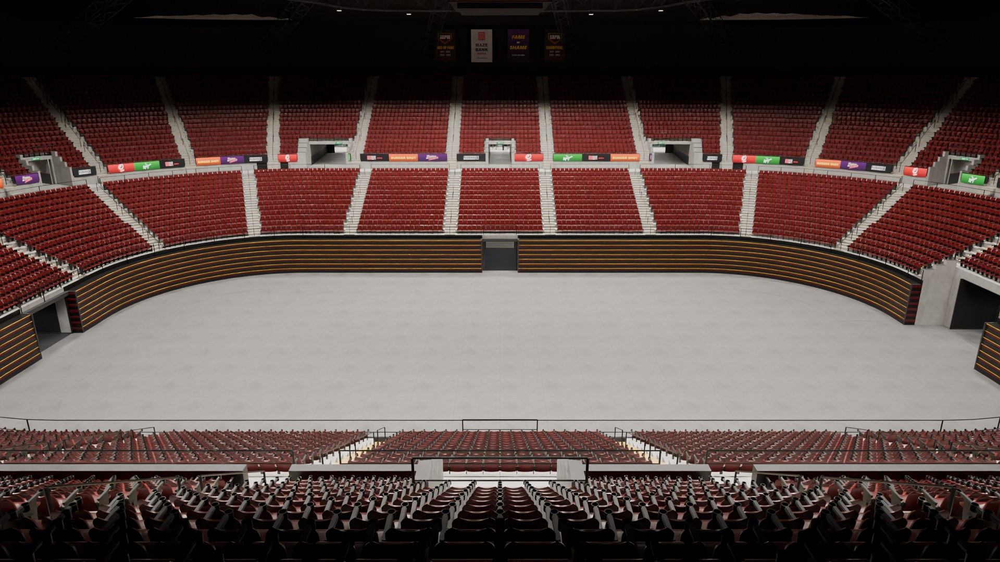<br>**The open floor** | 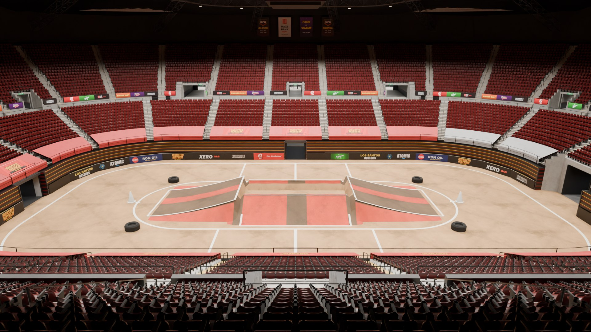<br>**Monster trucks** |
| 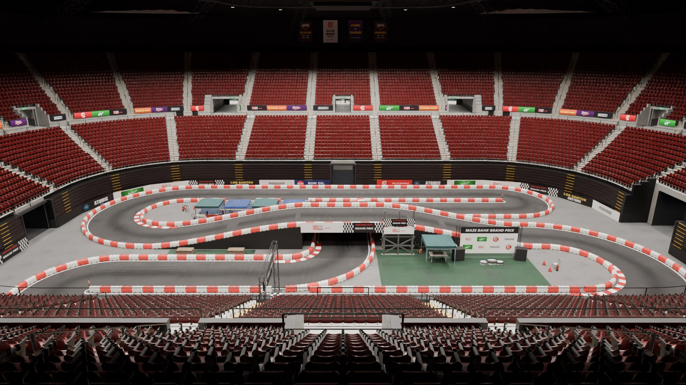<br>**Kart circuit: Grand Prix** (a flyover) | 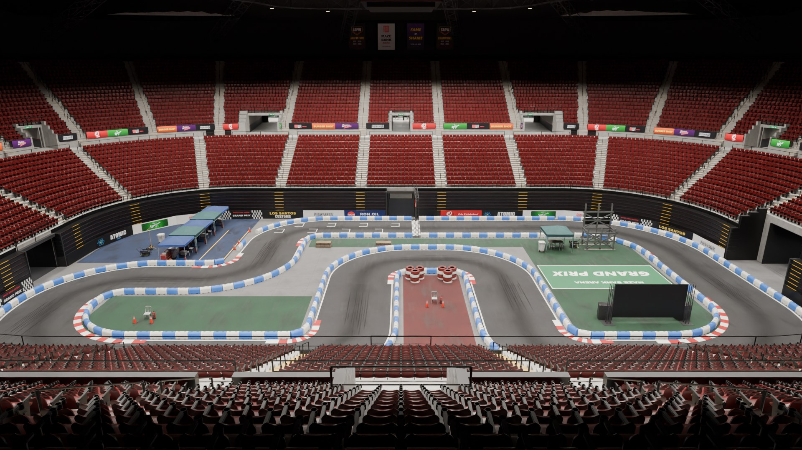<br>**Kart circuit: Sprint** |
| 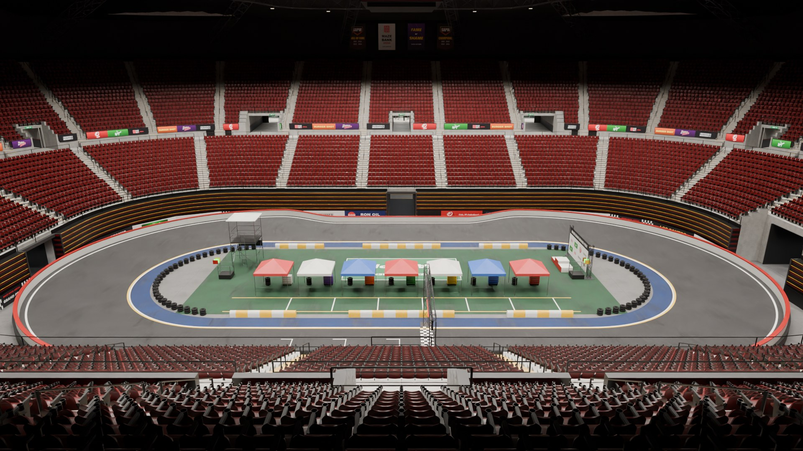<br>**Kart circuit: Oval** (banked ends) | 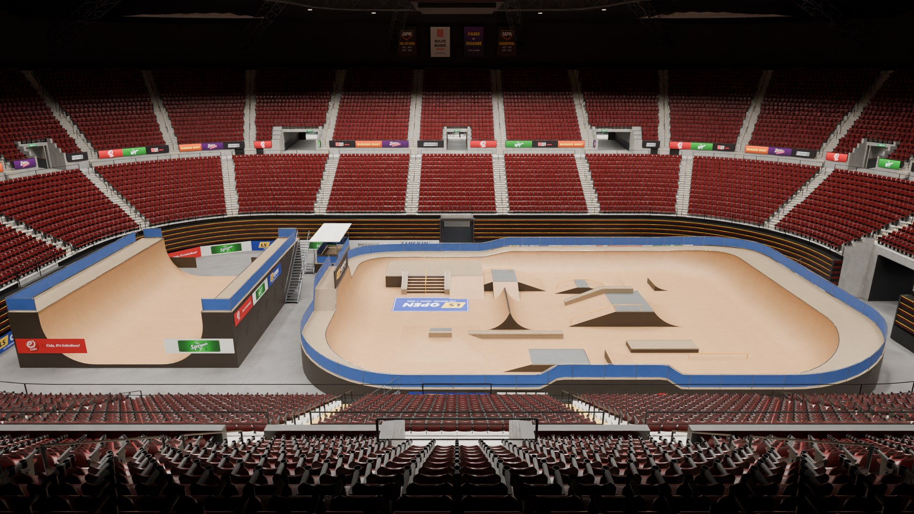<br>**Skate park** (park course and vert ramp) |
| 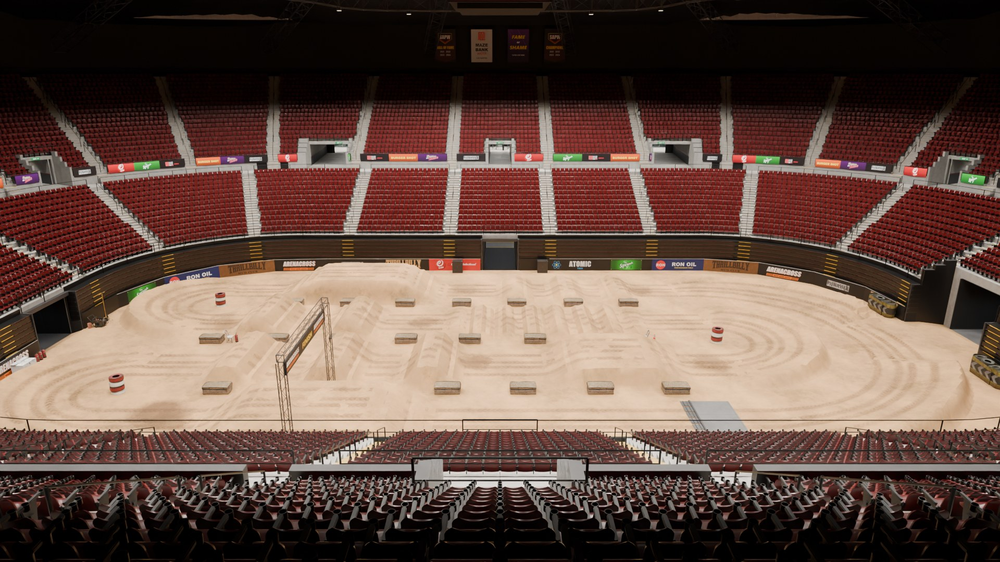<br>**Arenacross** (jumps, whoops, berms) | 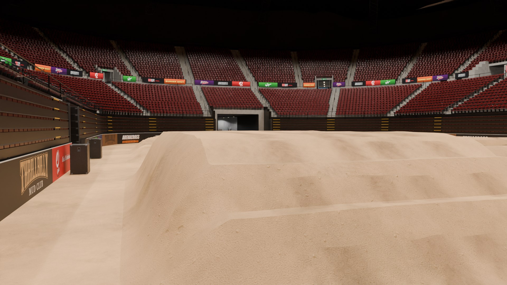<br>**Arenacross**: down on the dirt |

Down on the floor: the dressing is the game's own props.

| | |
|---|---|
| 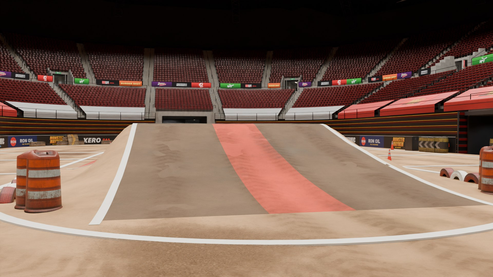<br>**Monster trucks**: the run up the long ramp | 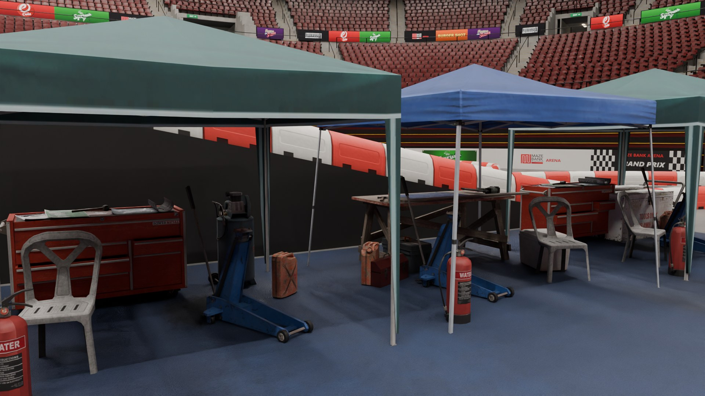<br>**Grand Prix**: the paddock |
| 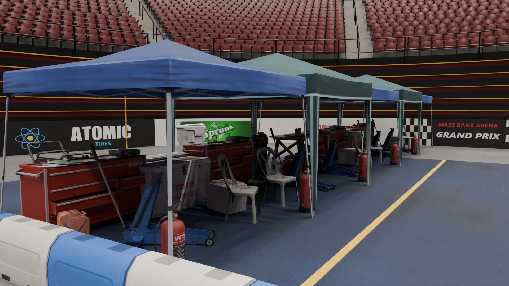<br>**Sprint**: the paddock and its pit lane | 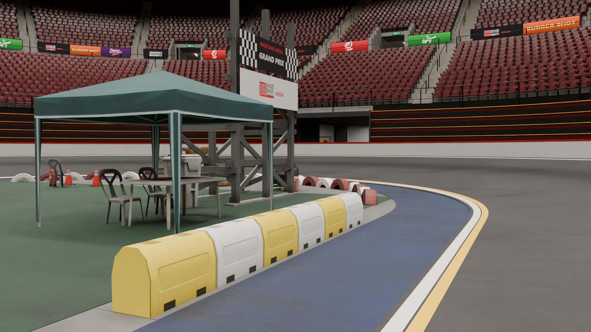<br>**Oval**: race control and the timing board |

### The merch stand

In the main lobby, dressed for whichever show is up: its own tables, backdrop and shirts. Every tee on the racks can be
tried on and bought (see "Trying on and buying the tees").

| | |
|---|---|
| 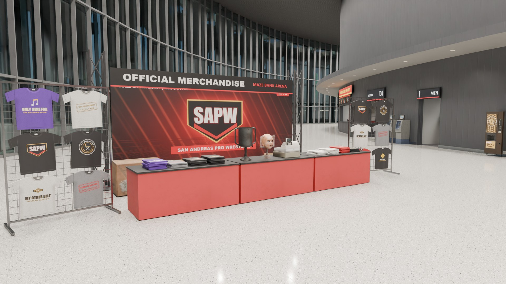<br>**Wrestling** | 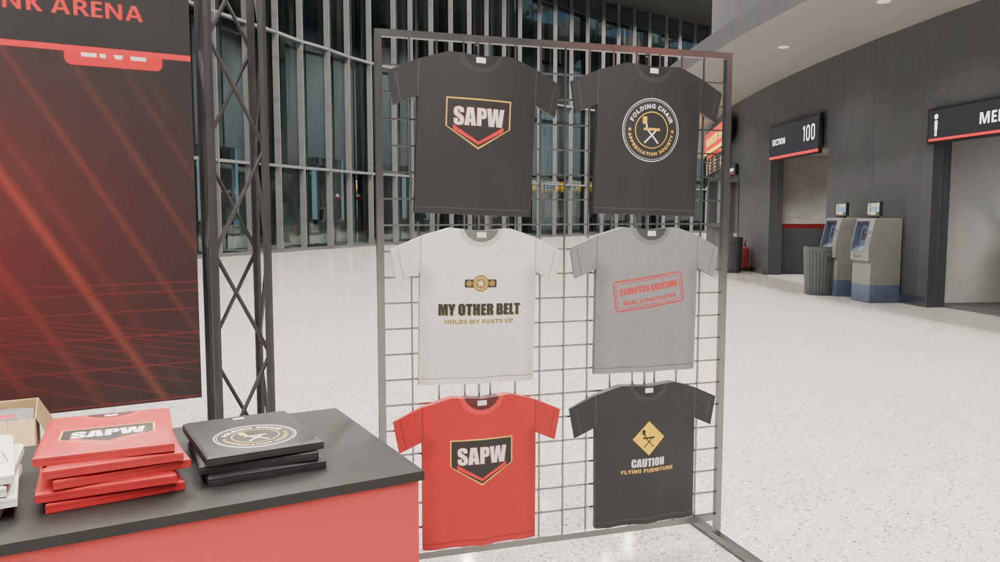<br>**A rack of the night's tees** |
| 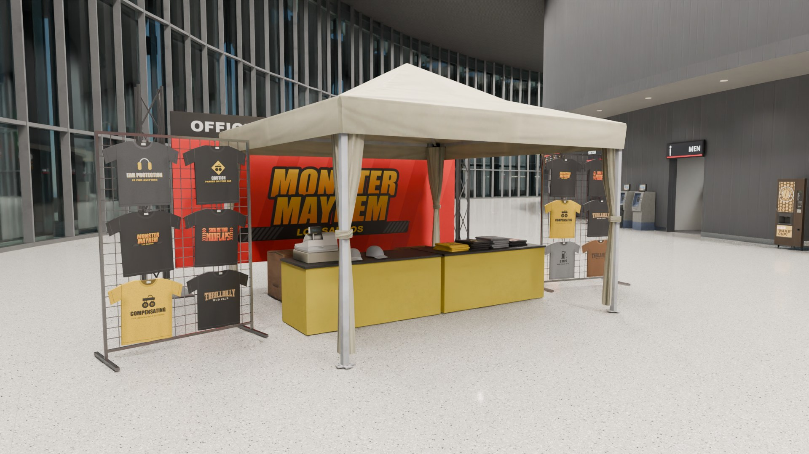<br>**Monster trucks** | 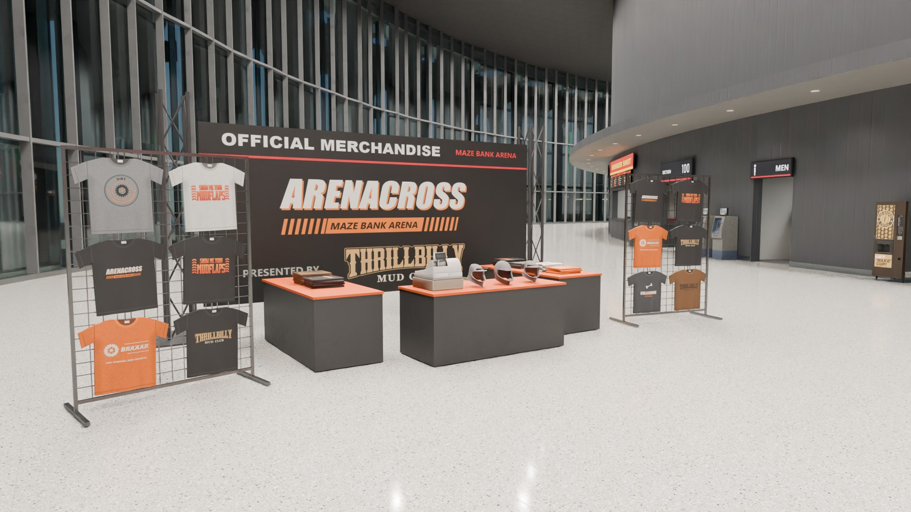<br>**Arenacross** |

## Requirements

- **Game build 2060 or newer** (`sv_enforceGameBuild 2060`). The interior uses vanilla props from the Diamond Casino
  Heist, After Hours and other DLC packs, and on older builds those props are missing.
- No framework or other resources. If your server runs **ox_lib**, the arena uses it for a staff menu and its
  notifications (below); without it, everything works from chat. The event desk and the merch stand likewise use
  **ox_target** or **qb-target** when one runs (else an **E** prompt), and **qbx_core**, **qb-core**, **es_extended**
  or **ox_inventory** for money and items when one runs (else see Merch, below). None of them is a dependency.

## Install

1. Put the `mzb_arena` folder in your `resources` folder.
2. Add it to `server.cfg`:
   ```
   ensure mzb_arena
   ```
3. Allow your staff to run the arena command:
   ```
   add_ace group.admin command.arena allow
   ```

**Other map packs.** This resource streams its own `sp1_occl_01.ymap`: Rockstar's occlusion for the area, with the
occluders that would hide the interior through the glass removed. If another resource streams the same file (for
example `cfx-gabz-mapdata`), `ensure mzb_arena` **after** it. Otherwise the arena's interior can vanish when you look
at it from outside. Our file keeps everything else in it as Rockstar shipped it.

The resource also replaces a handful of vanilla `sp1_10` files (the painted fake interior, the glass panes in front of
the gateway doors, the loading street's roller-door panels and their collision). Any other resource that replaces
these exact files will conflict with it.

`bob74_ipl` is fine: the arena removes Rockstar's Fame or Shame lobby IPL, which stood where the concourse is now.

**Lighting.** The interior ships its own time-cycle modifiers (`data/mzb_timecycle.xml`: `mzb_arena_int`,
`mzb_arena_concourse`), so the bowl and the back-of-house rooms look the same at any hour or weather. The glazed
concourse keeps its daylight, without the outdoor fog.

## Commands (ACE `command.arena`)

The quick switch, for staff on the spot:

```
/mzb wrestling        switch the show for everyone (late joiners get it too)
/mzb basketball       ... wrestling concert mma hockey basketball tennis house
/mzb monster          ... and the bigger floor's: floor monster motocross karting sprint oval skatepark
/mzb list             the shows, the current one in [brackets]
/mzb status           the current show and the dock doors
/mzb dock a open      the loading street's roller doors (a | b | c | all, open | close | toggle)
```

`/mzb` also takes the aliases in `Config.ShowAliases` (`/mzb fight` is MMA, `/mzb empty` is the empty house,
`/mzb open` the open floor, `/mzb trucks` the monster trucks, `/mzb mx` arenacross, `/mzb gp` the kart Grand Prix, `/mzb skate` the skate park, and so
on), suggests the show names in chat as you type, and uses the same permission as `/arena`: one ACE line covers both.
The long form still works:

```
/arena show <name>
/arena dock <a|b|c|all> <open|close|toggle>
/arena status
```

**With ox_lib** (`Config.OxLib = 'auto'`): `/mzb` or `/arena` with nothing after it opens an ox_lib menu instead:
pick the show (the one that is up is marked), open and shut the loading dock's doors, or open the light desk. What
the commands answer comes as an ox_lib notification rather than a chat line. The typed forms above work as before,
and the menu's picks are checked on the server with the same ACE. ox_lib is not a dependency: without it (or with
`Config.OxLib = false`) nothing changes. `Config.ShowLabels` has the menu's names and icons for the shows.

Every switch is logged in the server console with the player's name. A short cooldown (`Config.SwitchCooldown`)
stops a switch being spammed, since each one reloads the interior for everyone inside.

`/arenainfo` (everyone, client side) prints where you stand: the position, the room, the interior, the show and how
many of its sets your own game has switched on, which helps when reporting issues. `/arenareset` (everyone, your own
screen only) takes the show's pieces down and sets them up again.

## Exports (server)

```lua
exports.mzb_arena:SetShow('concert')        -- true / false (unknown show; aliases work too)
exports.mzb_arena:GetShow()                 -- the current show's name
exports.mzb_arena:GetShows()                -- every show's name, sorted
exports.mzb_arena:SetDock('a', 'open')      -- 'a' | 'b' | 'c' | 'all', 'open' | 'close' | 'toggle'
exports.mzb_arena:SetLights({ on = true, mode = 'strobe', colors = { 'red', 'white' }, bpm = 150, house = 'off' })
exports.mzb_arena:LightPreset('goal')       -- a Config.LightPresets name (a goal horn script can call it)
exports.mzb_arena:FadeLights(3)             -- the show lights fade out over 3 s, then off
exports.mzb_arena:GetLights()               -- the desk's current state
exports.mzb_arena:HideSets({ 'mzb_set_wwe_ring', 'mzb_set_wwe_stage' })   -- leave these pieces out, whatever the show
exports.mzb_arena:HideSets({})              -- ... and have them back
```

`HideSets` is for a resource that brings a ring, a stage or a floor of its own: the arena's pieces named (entity
sets from `Config.Shows`) are not switched on while they are in the list.

The current state is public in `GlobalState.mzbShow`, `GlobalState.mzbDock` and `GlobalState.mzbLights`, so a job
script or an ox_target panel can read it.

## Light desk (ACE `command.arena`)

The arena has its own light show on top of the interior's lighting: coloured spot lights from each show's rig (the
moving heads, beams and washes of the wrestling, concert and MMA rigs) and from the house lights up in the roof (every
show, and the only ones for hockey, basketball, tennis, the bigger floor's shows and the empty house). Every player
in the bowl sees the same show at the same moment.

`/arenalights` opens the desk (or a key: bind "Maze Bank Arena: open the desk" in the game's Key Bindings > FiveM,
or set `Config.LightDeskKey`). Its head stays put: show lights on / off, the ring lights, blackout, and what is on
the screens and in the speakers with a **Fade** and an **Off / Stop** beside each. Under it, four tabs (keys `1`-`4`,
the last one used is remembered):

- **Show**: the presets, the pyro, the truck show's cars, the crowd - what gets pressed during a show.
- **Lights**: the effect, the movement, up to three colours from a palette or a colour picker, the speed in BPM
  (with a tap button), intensity, the aim, follow the music, the house lights (the show's setting, full, dimmed,
  off), the ring lights' colour and level, the followspot.
- **Screens & music**: the screens' and the music player's sections (below).
- **Fights**: the card.

A section's title still folds it away, and the desk remembers. A look is built from independent parts, as on a
lighting console:

- **Effect** (the colour and level of each fixture): static, chase, strobe, pulse, rainbow, fade (a slow crossfade
  through the colours), wave (a band of light rolling round the rig), flash (the whole rig hits on the beat and dies
  away), alternate (every other fixture, swapping on the beat), bounce (a block of light running end to end), twinkle,
  random, lightning (dark, with ragged white flickers), fire (warm flicker) and police.
- **Movement** (where the beams go, with any effect): still, sweep, ballyhoo, fan (the spots open out and close in),
  nod (tilting out to the stands and back) and cross (pairs swinging across each other).
- **Aim**: floor, stage, crowd - or several at once (the fixtures take turns), e.g. floor and crowd.
- **Ring lights**: the ring truss's, the cage truss's and the concert rig's own lights (they light the ring, the cage
  and the stage, with the show lights on or off - TV lighting for the match while the rest of the rig runs the
  show), and the glow off the video wall onto the stage. They are on by default, each in the colour the build gave
  it; the desk turns them off, gives them all one colour, or sets their level.
- **The stage's trusses** (wrestling): their thirteen moving heads are show lights like the rest of the rig - the
  desk's colours, effects and movement, dark while the show lights are off. (Until 1.1.2 they were part of the stage
  model: always on, in red, white and blue.)
- **Presets**: walk-in, entrance, goal, concert, party, fight, police, TV ring, storm, inferno, hype, house up,
  blackout, reset.

It also runs from chat:

```
/arenalights on | off | blackout | status
/arenalights fade 3                   (the show lights fade out over 3 s, then off; no number: 2 s)
/arenalights mode wave                (the effect)
/arenalights move fan                 (none | sweep | ballyhoo | fan | nod | cross)
/arenalights color red white          (names from Config.LightColors, or #rrggbb; up to three)
/arenalights focus floor crowd        (one to three of floor, stage, crowd)
/arenalights ring on | off
/arenalights ring color red           (one colour for all of them; ring own = each its own colour again)
/arenalights ring level 60            (0-100)
/arenalights bpm 128 | intensity 80 | house dim
/arenalights follow on                (off | on | tempo | colour: the lights follow the music)
/arenalights preset storm
```

The interior's own (baked) lights can't change colour in GTA; the house buttons switch them between full, dimmed and
off, and the desk's colour comes from the spot lights it draws. That is why the rigs' ring lights are drawn by the
script (`shared/rig_lights.lua`, taken from the rig models, which no longer carry them). Players with
photosensitivity: `Config.LightMaxStrobeHz` caps the strobe (0 turns it into a pulse).

**Follow the music** (the Lights tab, `/arenalights follow <off|on|tempo|colour>`): the effects run on the beat of
what the music player is playing and in the colours of its video, instead of the Speed slider and the colour slots.
Each player's own game listens to the track (the kick drum's hits make the beat; the rig dips between them) and
looks at the video's picture five times a second for its two or three main colours - a YouTube track's video, or the
screens' video while its sound comes from the speakers. A file has no picture and a pause no beat: the desk's own
colours and speed stay for whatever is not there. `Config.LightFollow` has how hard the rig hits the beat (`punch`),
how far quiet passages dim it, and how soft a hit still counts (`sensitivity`).

## The crowd (ACE `command.arena`)

Staff can fill the house: people in the bowl's seats, in the floor chairs of the shows that have them (wrestling, MMA,
basketball, tennis) and on the concert's standing floor, a row of them on the barricade. The stage end is only seated
for the shows that seat it: the end-stage shows kill the seats behind their masking, as real ones do. The bigger
floor's shows (floor, monster, motocross, karting, sprint, oval, skatepark) have the lower tier's front seven rows folded back all
round, so nobody sits in them, and the truck show keeps the three rows behind those closed as well, under their
tarps (`Config.Crowd.ClosedDepth`: how deep in the stands a show's closed rows go, in metres from the floor's edge).

```
/arenacrowd on | off | toggle         bring the crowd in / send it home (for everyone)
/arenacrowd mood show                 doors | show | peak | cheer
/arenacrowd staff on | off | toggle   the staff and the press who come in with the crowd
/arenacrowd litter some               clean | some | trashed: what the crowd leaves in the rows and on the floor
/arenacrowd                           what the crowd is doing
/arenacrowd mine 80                   how many crowd peds YOU see: anyone may set it, it is saved on your PC
```

The desk (`/arenalights`) has the same controls in its Crowd section, with a slider for your own count.

- **Moods**: `doors` (in their seats, on their phones, a few standing about), `show` (watching: most sit, some clap
  and film), `peak` (the whole house on its feet) and `cheer` (applause). `Config.CrowdMoods` sets what each one does
  and how much of the house sits. The light desk's presets carry a mood too (`mood` in `Config.LightPresets`: Goal!
  brings the house to its feet cheering, Walk-in sits it down); `Config.CrowdPresetMoods = false` leaves the crowd
  to you.
- **How many**: the game has room for 256 peds of every kind at once, and the arena has more than seventeen thousand
  seats. Each player sees up to `Config.Crowd.MaxPeds` people (210; `/arenacrowd mine` goes up to `MaxPedsLimit`,
  240): half of them are the house, the same for everyone, filling ringside and the lower rows first with people all
  round the bowl; the other half fill the seats round wherever you are. They sit in parties of one to four, the way
  a house fills. Lower it on a busy server: other players and the street's peds count against the same 256.
- **Round the building**: with the crowd come the concourse's people (`Config.Concourse`, 163 spots from the build):
  vendors and bartenders behind the tills with fans queueing, cooks, the shops' clerks, guards at the detectors and
  in the security office, medics, cleaners, people at the lobbies' high tables. The nearest 36 are made (8 while you
  are in the bowl, so the seats get the rest).
- **Cost**: the crowd is made of local peds, so nothing is synced but its on / off and its mood, and each player only
  makes it while inside the arena. It stops making people while the game is close to its ped limit
  (`Config.Crowd.PoolLimit`), and `Config.Crowd.Collision = false` lets players walk through it. People fade in
  rather than pop up (`FadeMs`), and a show can have its own mix of peds (`Config.Crowd.ShowModels`).
- **Staff and press** come in with the crowd, 9 to 18 per show, on top of your own count: security inside the
  barricades with their backs to the action, ringside / cageside / pit photographers (their cameras flash), camera
  operators with a shoulder camera or behind a tripod camera, the concert's crew at the mixing desk, ball kids
  kneeling at the tennis net and the back corners, and officials who sit at the basketball scorer's table, in the
  tennis umpire's chair, on the line judges' chairs and at the hockey timekeeper's desk. Every spot is the build's
  and checked like the seats: a floor under it, nothing in the way, clear of the chairs, the props and the tunnels'
  mouths. Who stands there is `Config.CrowdRoles` (their peds, what they do, the camera they hold or stand behind);
  `Config.CrowdStaffEnabled = false` turns them off for good.
- **Litter**: cups, cans, wrappers, food bags and bottles at the crowd's feet, in the rows and on the floor, at the
  level staff set (`clean`, `some`, `trashed`); it stays when the crowd goes home. Each piece is picked from its spot,
  so everyone sees the same mess, and only the nearest 260 within 60 m of you are put down (`Config.Litter`).

```lua
exports.mzb_arena:SetCrowd({ on = true, mood = 'peak' })   -- any of on, mood, staff, litter
exports.mzb_arena:GetCrowd()                               -- { on, mood, staff, litter }; also GlobalState.mzbCrowd
```

The spots come from the build (`client/crowd_slots.lua`): the seats and chairs of the interior itself, each one
checked against its collision.

## Fights

Bouts in the wrestling ring and the MMA cage: watch two NPCs fight, put a card of bouts on, take on an NPC yourself,
or fight another player. The server runs every bout: it makes the NPC fighters (networked, so everyone sees the same
fight), rings the rounds and calls the result from what it sees itself, never from what a client says.

```
/arenafight                              the bout on and the card (anyone)
/arenafight challenge                    an NPC takes you on (anyone in the arena; Config.Fights.challenge)
/arenafight challenge <id>               challenge a player, who answers /arenafight accept within 30 s
/arenafight npc [in <minutes>]           staff: an NPC bout on the card (now, or at a time)
/arenafight vs <id> [in <minutes>]       staff: a player against an NPC
/arenafight pvp <id> <id> [in <minutes>] staff: player against player
/arenafight stop | clear                 staff: stop the bout on / empty the card
```

The desk has a Fights section: pick the red and blue corners (an NPC or any player in the arena), when (next, or in
1, 5 or 15 minutes), add the bout; stop it; clear the card.

- **A bout**: a walk-out (the names on the screen, the fighters to their corners: a player who is not in the ring
  at the bell forfeits), then three rounds of a minute with breaks between them (`Config.Fights.rounds`,
  `roundSeconds`, `breakSeconds`). A fighter whose health falls to `koHealth` (125 of 200) is knocked out; one out
  of the ring for ten seconds loses on a count-out; one who leaves the server forfeits; after the last round the one
  with more health left wins on points. Nobody dies: the fighters are held above the line during the rounds and the
  loser is helped up healed. Players fight with their fists only.
- **The show goes with it**: everyone in the arena gets the fight bar at the top of the screen (the names, how much
  each has left, the round and its clock, the result, the next bout on the card), the bell and the knockout. The
  light desk's presets and the crowd's mood follow the bout (`Config.Fights.presets` / `moods`: entrance for the
  walk-out, fight for the rounds, goal for the result), and a followspot that is on follows the player fighters.
- **The card**: bouts go in the order they were added; one with a time waits for it; 20 seconds between bouts
  (`gap`). Switching to another show stops the bout on (no contest) and holds the card until the ring or the cage is
  back.
- Fighting another player needs the server to let players hurt each other (most do). The building has no ped
  navmesh yet, so the NPC fighters start face to face in the ring and are held inside it.

Exports (server): `AddBout(red, blue, inMinutes)` (red / blue = `'npc'` or a server id), `StopBout()`, `GetBout()`;
the state is `GlobalState.mzbFight` (and `mzbFightCard`).

## The event desk

An event official with a clipboard stands at the floor end of the event tunnel (`Config.EventDesk.ped`: the model,
the place, the scenario). Walk up and talk to him: through **ox_target** or **qb-target** if your server runs one,
else an **E** prompt within `distance`. He is a local ped, there while you are within 60 m. What he offers goes by
the show that is up:

- **A show with a track** (`karting`, `sprint`, `oval`, `monster`, `motocross`): the race. Join it, leave it, start
  it now if you were first on the list, and see who has signed up (Racing, below).
- **A show with a ring or a cage** (`wrestling`, `mma`): set up a fight. Take on an NPC, challenge a player near
  you, accept a challenge, ask for the card: `/arenafight challenge` and `accept` behind a menu, with the same rules
  (Fights, above). `Config.EventDesk.fights = 'staff'` keeps them to the fight card's staff.
- **Any other show**: nothing to sign up for.

The menu is an ox_lib context menu when the server runs ox_lib; without it, a numbered list on the left of the
screen (the number keys pick, Backspace shuts it). Every pick is checked by the server: that you are at the desk,
that the show has what you asked for, that you may.

## Racing

Each show with a track has a race on it, signed up for at the event desk:

| Show | Race | Laps | A lap | Grid | Vehicle (the first your game build has) |
|---|---|---|---|---|---|
| `karting` | Grand Prix | 5 | 266 m | 8 | `veto2`, `veto`, else `blazer` |
| `sprint` | Sprint | 6 | 201 m | 8 | `veto2`, `veto`, else `blazer` |
| `oval` | Oval | 8 | 154 m | 10 | `veto2`, `veto`, else `blazer` |
| `monster` | Monster Mayhem | 3 | 134 m | 4 | `monster`, else `sandking` |
| `motocross` | Arenacross | 4 | 257 m | 8 | `sanchez2`, `bf400`, `manchez`, `sanchez` |

- **Sign-up**: the first player to join opens it for 45 seconds (`Config.Race.signup`) and may start it early at
  the desk; everyone in or at the arena is told. Grid slots go in the order of joining, as many as the track has.
- **The start**: every racer is put on their slot in the track's vehicle, held there through the countdown, and let
  go together.
- **The race**: the next checkpoint is a marker on the track and a blip (the line is the chequered one); position,
  lap and time are at the bottom of the screen. The server counts a checkpoint only when it is the next one in order
  and it sees the racer near it, so nothing a client says wins a race. The Grand Prix's flyover counts at its own
  height only: driving under it does not.
- **The end**: the winner is announced to the arena, and whoever has not finished 240 seconds later (`dnf`) is
  classified DNF. Out of the vehicle for 15 seconds, dead, or gone from the server: retired. The vehicles are taken
  away and the racers stand at the desk again (`Config.Race.returnTo` for somewhere else).
- Switching to another show calls the race off (an entry fee goes back).

```
/arenarace                 the race on, or the last result (anyone)
/arenarace start           staff: close the sign-up and go
/arenarace cancel          staff: call the race off
```

`Config.Race` has the times, `minPlayers`, `fee` and `prize` (money through the bridge below, 0 = none), `access`
(who may run the command: the light desk's ACE unless set) and `enabled`. The tracks themselves (grid, checkpoints,
laps, vehicles) are `Config.Races` in `shared/races.lua`, made from the tracks' own centre lines: change `laps` or
`vehicles` there if you like, leave the coordinates. The racers' vehicles are made by their own games (networked),
so a server that blocks client-made entities has to let these through. A full tank is set for the usual fuel scripts
and qb-vehiclekeys is handed the keys; for anything else the client event `mzb_arena:raceVehicle` (the vehicle, its
plate) fires when a racer's vehicle is made. Exports (server): `GetRace()`, `CancelRace()`; the state is
`GlobalState.mzbRace`.

## Merch

The lobby's merch stand is dressed for the show that is up (an entity set per stand, `mzb_set_merch_<style>`, in
`Config.Shows`) and has a seller (`Config.Merch.ped`): talk to her as to the event desk's official and she lists what
that show's stand sells. The kart circuits share a stand; the empty house and the open floor have the arena's own.
A purchase is the item's name sent to the server, which looks the item and its price up itself in
`Config.Merch.items`, checks that you are standing at the stand, takes the money and hands the item over. The tees
hanging on the stand's walls are a shop of their own, with a try-on: Trying on and buying the tees, below.

**Money and items** go through one small bridge (`server/bridge.lua`), which uses the first of these your server
runs:

1. **qbx_core** (cash; items through ox_inventory)
2. **qb-core** (cash; the player's own inventory)
3. **es_extended** (cash; ox_inventory when it runs, else ESX's inventory)
4. **ox_inventory** on its own (its `money` item)
5. none of them: only a price of 0 can be "bought" and nothing is handed over, the player is just told they have
   it. Set the prices to 0 for a souvenir stand, or run one of the above.

An item your inventory does not know is not sold: the money goes straight back and the player is told which item is
missing. So register the ones you want to sell, and take the others out of `Config.Merch.items` (names, labels and
prices are yours to change there):

| Stand (shows) | Items |
|---|---|
| SAPW (`wrestling`) | `mzb_tee_sapw` SAPW Tee ($35), `mzb_cap_sapw` SAPW Cap ($25), `mzb_finger_sapw` SAPW Foam Finger ($15), `mzb_poster_sapw` SAPW Poster ($12), `mzb_programme_sapw` SAPW Programme ($10), `mzb_belt_sapw` SAPW Replica Title Belt ($150) |
| Sirens of San Andreas - The Neon Coast Tour (`concert`) | `mzb_tee_sirens` Sirens of San Andreas Tour Tee ($40), `mzb_hoodie_sirens` Neon Coast Tour Hoodie ($70), `mzb_cap_sirens` Sirens of San Andreas Cap ($25), `mzb_poster_sirens` Neon Coast Tour Poster ($15), `mzb_programme_sirens` Neon Coast Tour Programme ($12), `mzb_glowstick_sirens` Neon Coast Glow Stick ($8) |
| SAFC - Vespucci Vengeance (`mma`) | `mzb_tee_safc` SAFC Tee ($35), `mzb_cap_safc` SAFC Cap ($25), `mzb_gloves_safc` SAFC Replica Gloves ($60), `mzb_poster_safc` Vespucci Vengeance Poster ($12), `mzb_programme_safc` Vespucci Vengeance Programme ($10) |
| Los Santos Blizzard (`hockey`) | `mzb_jersey_blizzard` Los Santos Blizzard Jersey ($90), `mzb_tee_blizzard` Los Santos Blizzard Tee ($35), `mzb_cap_blizzard` Los Santos Blizzard Cap ($25), `mzb_finger_blizzard` Los Santos Blizzard Foam Finger ($15), `mzb_puck_blizzard` Los Santos Blizzard Puck ($18), `mzb_programme_blizzard` Los Santos Blizzard Programme ($10) |
| LS Panic (`basketball`) | `mzb_jersey_panic` LS Panic Jersey ($85), `mzb_tee_panic` LS Panic Tee ($35), `mzb_cap_panic` LS Panic Cap ($25), `mzb_finger_panic` LS Panic Foam Finger ($15), `mzb_ball_panic` LS Panic Mini Basketball ($20), `mzb_programme_panic` LS Panic Programme ($10) |
| Maze Bank Open (`tennis`) | `mzb_tee_mbopen` Maze Bank Open Tee ($35), `mzb_visor_mbopen` Maze Bank Open Visor ($22), `mzb_towel_mbopen` Maze Bank Open Towel ($30), `mzb_ball_mbopen` Maze Bank Open Souvenir Ball ($15), `mzb_programme_mbopen` Maze Bank Open Programme ($10) |
| Monster Mayhem (`monster`) | `mzb_tee_mayhem` Monster Mayhem Tee ($35), `mzb_cap_mayhem` Monster Mayhem Cap ($25), `mzb_finger_mayhem` Monster Mayhem Foam Finger ($15), `mzb_poster_mayhem` Monster Mayhem Poster ($12), `mzb_programme_mayhem` Monster Mayhem Programme ($10), `mzb_tee_mudflaps` SHOW ME YOUR MUDFLAPS Tee ($35), `mzb_tee_thrillbilly` Thrillbilly Mud Club Tee ($35) |
| Maze Bank Grand Prix (`karting`, `sprint`, `oval`) | `mzb_tee_gp` Maze Bank Grand Prix Tee ($35), `mzb_cap_gp` Maze Bank Grand Prix Cap ($25), `mzb_flag_gp` Maze Bank Grand Prix Chequered Flag ($15), `mzb_poster_gp` Maze Bank Grand Prix Poster ($12), `mzb_programme_gp` Maze Bank Grand Prix Programme ($10), `mzb_tee_mudflaps` SHOW ME YOUR MUDFLAPS Tee ($35), `mzb_tee_thrillbilly` Thrillbilly Mud Club Tee ($35) |
| Arenacross (`motocross`) | `mzb_tee_arenacross` Arenacross Tee ($35), `mzb_jersey_arenacross` Arenacross Race Jersey ($60), `mzb_cap_arenacross` Arenacross Cap ($25), `mzb_poster_arenacross` Arenacross Poster ($12), `mzb_programme_arenacross` Arenacross Programme ($10), `mzb_tee_mudflaps` SHOW ME YOUR MUDFLAPS Tee ($35), `mzb_tee_thrillbilly` Thrillbilly Mud Club Tee ($35) |
| Los Santos Open (`skatepark`) | `mzb_tee_lsopen` Los Santos Open Tee ($35), `mzb_hoodie_lsopen` Los Santos Open Hoodie ($65), `mzb_cap_lsopen` Los Santos Open Cap ($25), `mzb_deck_lsopen` Los Santos Open Skate Deck ($80), `mzb_stickers_lsopen` Los Santos Open Sticker Pack ($8), `mzb_poster_lsopen` Los Santos Open Poster ($12) |
| Maze Bank Arena (`house`, `floor`) | `mzb_tee_arena` Maze Bank Arena Tee ($30), `mzb_hoodie_arena` Maze Bank Arena Hoodie ($60), `mzb_cap_arena` Maze Bank Arena Cap ($25), `mzb_finger_arena` Maze Bank Arena Foam Finger ($15), `mzb_mug_arena` Maze Bank Arena Mug ($14), `mzb_keyring_arena` Maze Bank Arena Keyring ($6) |

For **ox_inventory**, in `data/items.lua` (the pictures are up to you: `web/images/<item name>.png`); qb-core's
`shared/items.lua` takes the same names:

```lua
    ['mzb_tee_sapw'] = { label = 'SAPW Tee', weight = 200 },
    ['mzb_cap_sapw'] = { label = 'SAPW Cap', weight = 100 },
    ['mzb_finger_sapw'] = { label = 'SAPW Foam Finger', weight = 150 },
    ['mzb_poster_sapw'] = { label = 'SAPW Poster', weight = 50 },
    ['mzb_programme_sapw'] = { label = 'SAPW Programme', weight = 100 },
    ['mzb_belt_sapw'] = { label = 'SAPW Replica Title Belt', weight = 2500 },
    ['mzb_tee_sirens'] = { label = 'Sirens of San Andreas Tour Tee', weight = 200 },
    ['mzb_hoodie_sirens'] = { label = 'Neon Coast Tour Hoodie', weight = 450 },
    ['mzb_cap_sirens'] = { label = 'Sirens of San Andreas Cap', weight = 100 },
    ['mzb_poster_sirens'] = { label = 'Neon Coast Tour Poster', weight = 50 },
    ['mzb_programme_sirens'] = { label = 'Neon Coast Tour Programme', weight = 100 },
    ['mzb_glowstick_sirens'] = { label = 'Neon Coast Glow Stick', weight = 50 },
    ['mzb_tee_safc'] = { label = 'SAFC Tee', weight = 200 },
    ['mzb_cap_safc'] = { label = 'SAFC Cap', weight = 100 },
    ['mzb_gloves_safc'] = { label = 'SAFC Replica Gloves', weight = 400 },
    ['mzb_poster_safc'] = { label = 'Vespucci Vengeance Poster', weight = 50 },
    ['mzb_programme_safc'] = { label = 'Vespucci Vengeance Programme', weight = 100 },
    ['mzb_jersey_blizzard'] = { label = 'Los Santos Blizzard Jersey', weight = 300 },
    ['mzb_tee_blizzard'] = { label = 'Los Santos Blizzard Tee', weight = 200 },
    ['mzb_cap_blizzard'] = { label = 'Los Santos Blizzard Cap', weight = 100 },
    ['mzb_finger_blizzard'] = { label = 'Los Santos Blizzard Foam Finger', weight = 150 },
    ['mzb_puck_blizzard'] = { label = 'Los Santos Blizzard Puck', weight = 170 },
    ['mzb_programme_blizzard'] = { label = 'Los Santos Blizzard Programme', weight = 100 },
    ['mzb_jersey_panic'] = { label = 'LS Panic Jersey', weight = 300 },
    ['mzb_tee_panic'] = { label = 'LS Panic Tee', weight = 200 },
    ['mzb_cap_panic'] = { label = 'LS Panic Cap', weight = 100 },
    ['mzb_finger_panic'] = { label = 'LS Panic Foam Finger', weight = 150 },
    ['mzb_ball_panic'] = { label = 'LS Panic Mini Basketball', weight = 300 },
    ['mzb_programme_panic'] = { label = 'LS Panic Programme', weight = 100 },
    ['mzb_tee_mbopen'] = { label = 'Maze Bank Open Tee', weight = 200 },
    ['mzb_visor_mbopen'] = { label = 'Maze Bank Open Visor', weight = 80 },
    ['mzb_towel_mbopen'] = { label = 'Maze Bank Open Towel', weight = 300 },
    ['mzb_ball_mbopen'] = { label = 'Maze Bank Open Souvenir Ball', weight = 60 },
    ['mzb_programme_mbopen'] = { label = 'Maze Bank Open Programme', weight = 100 },
    ['mzb_tee_mayhem'] = { label = 'Monster Mayhem Tee', weight = 200 },
    ['mzb_cap_mayhem'] = { label = 'Monster Mayhem Cap', weight = 100 },
    ['mzb_finger_mayhem'] = { label = 'Monster Mayhem Foam Finger', weight = 150 },
    ['mzb_poster_mayhem'] = { label = 'Monster Mayhem Poster', weight = 50 },
    ['mzb_programme_mayhem'] = { label = 'Monster Mayhem Programme', weight = 100 },
    ['mzb_tee_mudflaps'] = { label = 'SHOW ME YOUR MUDFLAPS Tee', weight = 200 },
    ['mzb_tee_thrillbilly'] = { label = 'Thrillbilly Mud Club Tee', weight = 200 },
    ['mzb_tee_gp'] = { label = 'Maze Bank Grand Prix Tee', weight = 200 },
    ['mzb_cap_gp'] = { label = 'Maze Bank Grand Prix Cap', weight = 100 },
    ['mzb_flag_gp'] = { label = 'Maze Bank Grand Prix Chequered Flag', weight = 100 },
    ['mzb_poster_gp'] = { label = 'Maze Bank Grand Prix Poster', weight = 50 },
    ['mzb_programme_gp'] = { label = 'Maze Bank Grand Prix Programme', weight = 100 },
    ['mzb_tee_arenacross'] = { label = 'Arenacross Tee', weight = 200 },
    ['mzb_jersey_arenacross'] = { label = 'Arenacross Race Jersey', weight = 300 },
    ['mzb_cap_arenacross'] = { label = 'Arenacross Cap', weight = 100 },
    ['mzb_poster_arenacross'] = { label = 'Arenacross Poster', weight = 50 },
    ['mzb_programme_arenacross'] = { label = 'Arenacross Programme', weight = 100 },
    ['mzb_tee_lsopen'] = { label = 'Los Santos Open Tee', weight = 200 },
    ['mzb_hoodie_lsopen'] = { label = 'Los Santos Open Hoodie', weight = 450 },
    ['mzb_cap_lsopen'] = { label = 'Los Santos Open Cap', weight = 100 },
    ['mzb_deck_lsopen'] = { label = 'Los Santos Open Skate Deck', weight = 1500 },
    ['mzb_stickers_lsopen'] = { label = 'Los Santos Open Sticker Pack', weight = 20 },
    ['mzb_poster_lsopen'] = { label = 'Los Santos Open Poster', weight = 50 },
    ['mzb_tee_arena'] = { label = 'Maze Bank Arena Tee', weight = 200 },
    ['mzb_hoodie_arena'] = { label = 'Maze Bank Arena Hoodie', weight = 450 },
    ['mzb_cap_arena'] = { label = 'Maze Bank Arena Cap', weight = 100 },
    ['mzb_finger_arena'] = { label = 'Maze Bank Arena Foam Finger', weight = 150 },
    ['mzb_mug_arena'] = { label = 'Maze Bank Arena Mug', weight = 350 },
    ['mzb_keyring_arena'] = { label = 'Maze Bank Arena Keyring', weight = 30 },
```

## Trying on and buying the tees

Every tee hanging on the merch stand's walls can be tried on and bought, the way a clothes shop in the game works.
Walk up to one: the nearest carries a white dot and the word TEES, and you pick it through **ox_target** or
**qb-target** (a small zone on every hanging tee) when the server runs one, else by looking at it and pressing **E**.
Your character turns its back to the wall, the camera cuts to its front, and the tee is on:

| Key | What it does |
|---|---|
| **Left** / **Right** | show the stand's other tees (eight to a stand) |
| **Enter** | buy and wear it; wear it if you own it; take it off if you are wearing it |
| **Up** / **Down** | the same design as a T-shirt or as a tank top (when the stand's pack has both) |
| **Backspace** / **Esc** | leave |

The screen shows what a shop shows: the category top left, your cash top right (when the server has a framework to
ask), bottom left the price, the tee's name and colour, a row of swatches (the one that is on framed, the ones you
own ticked) and "Not owned" / "Owned" / "Wearing", the keys bottom right, and "Purchased" on the right when you buy.
Leaving, you wear what you kept: a tee you bought or put on, else what you came in with. One you only tried is off
again.

- **The shirts** are addon clothing for the two freemode characters, streamed by the resource (`stream/clothes`):
  the top (component 11), one drawable per stand and a texture per tee, in the collections `mp_m_mzbmerch` and
  `mp_f_mzbmerch` (`Config.MerchShop.collection`). Any other ped model is told the shirts do not fit it.
  `Config.MerchShop.fit` is the arms and the undershirt that go on with a tee (check them in game against your
  characters); `firstDrawable` is only for a client build without the collection natives.
- **The price** is `Config.MerchShop.price` (35), or per stand with `prices = { monster = 40 }`; the money goes
  through the same bridge as the seller's (Merch, above). The server decides every purchase: the stand has to be
  the show's own, you have to be standing at it as a freemode character, and the price is never the client's.
- **What you own** is kept by the server per licence, in the resource's own KVP (`mzb_tees:<licence>`): no database
  and no inventory item, and it is still yours after a restart. Wearing a tee you own, and taking it off, cost
  nothing.
- **Saving the look**: after a purchase, a wear or a remove, the look is saved through **illenium-appearance** when
  the server runs it (`Config.MerchShop.save`). For any other clothing script, hook the client event
  `mzb_arena:shop:worn` (the style, the tee or `false` for taken off, and the top's drawable and texture as they
  are on the ped) and save from there.
- Which tees hang where, and what they are called, is `Config.MerchTees` in `shared/merch_tees.lua`, made with the
  stands (not edited by hand); the swatches are `html/img/tees/<style>.jpg`. `Config.MerchShop.reach` is how close
  you have to be to a tee, `camera` where the try-on camera stands.

## Slippery ice

While the `hockey` show is up, the rink's surface is GTA's ice: vehicles slide on it, and on foot you keep your
momentum. You glide on when you let go, overshoot a stop and drift through turns, and a hard turn at a sprint can put
you on the ice. `Config.Ice` sets how slippery it is, the top gliding speed, and whether players can fall and how
often.

## Video on the screens (pmms and other TV scripts)

Every show's screens are one object on one render target, **`mzb_screens`**, so a single media player drives them
all: the titantron with its lower panels and wings (wrestling), the LED wall and the side screens (concert), the LED
wall (MMA), and the centre-hung board's four faces (every show). The picture and sound come from one source. With
nothing playing, the screens are clear and the show's own graphics show through.

The object sits at the centre of the arena floor. There is one model per show:

| Show | Model |
|---|---|
| `wrestling` | `mzb_screens_wrestling` |
| `concert` | `mzb_screens_concert` |
| `mma` | `mzb_screens_mma` |
| `hockey`, `basketball`, `tennis`, `house`, and every other show (`floor`, `monster`, `motocross`, `karting`, `sprint`, `oval`, `skatepark`, a show of your own) | `mzb_screens_board` |

**pmms:** add these to `Config.models` in pmms' `config.lua`, then stand in the bowl, open pmms and pick the arena
screens:

```lua
[`mzb_screens_wrestling`] = { label = "Maze Bank Arena screens", renderTarget = "mzb_screens" },
[`mzb_screens_concert`]   = { label = "Maze Bank Arena screens", renderTarget = "mzb_screens" },
[`mzb_screens_mma`]       = { label = "Maze Bank Arena screens", renderTarget = "mzb_screens" },
[`mzb_screens_board`]     = { label = "Maze Bank Arena screens", renderTarget = "mzb_screens" },
```

Any other TV or cinema script that plays on a model through a named render target works the same way: register the
model(s) above with the render target `mzb_screens`. Switching the show swaps the screen object, so start the video
again after a switch.

## Built-in screen player (ACE `command.arena`)

The arena can play on its own screens without another resource: a YouTube video, a cycle of pictures or one
picture, on every screen of the show at once, the same moment for every player (late joiners too). Run it from the
light desk's **Screens** section (paste a link, play / pause / off, loop, volume, picture sets) or from chat:

| Command | What it does |
|---|---|
| `/arenascreen <youtube link or id>` | play a video (watch, youtu.be, shorts, embed and live links all work) |
| `/arenascreen <picture url> [more ...]` | one picture, or a cycle of several (https only) |
| `/arenascreen images [set]` | a picture set from `Config.Media.imageSets` (no name: the show's own set) |
| `/arenascreen look` | **a camera feed**: your own view of the game, live on the screens (below) |
| `/arenascreen look <player id>` | that player's view; `/arenascreen look off` ends a feed |
| `/arenascreen look <name>` | an LED-wall look drawn in step with the lights: show, pulse, colour, bars, stripes, waves |
| `/arenascreen pause` / `resume` | |
| `/arenascreen loop [on\|off]` | **loop** the video that is on: at its end it starts again (nothing after it: the other way) |
| `/arenascreen off` | the screens go dark |
| `/arenascreen own` | the show's own graphics again (nothing of ours on the screens) |
| `/arenascreen fade [seconds]` | fade to black (3 s unless said), then off; a video's sound from the speakers fades with it |
| `/arenascreen volume <0-100>` / `interval <s>` | the browser's own volume (only with `Config.Media.sound = 'screen'`); seconds per picture |
| `/arenascreen status` | what is on |
| `/arenascreeninfo` | for you only: whether the screens' page loaded and is being drawn (to report a dark screen) |

**A video starts a moment after the Play** (`Config.Media.leadIn`, 2.5 s): every player's game has it loaded by
then, so it starts at its start for everyone at once instead of a second in. The screens are dark for that moment.

**Off is dark.** The desk's **Off** (and a Blackout while the screens show a look or nothing) puts a black picture
over the show's own graphics, so the titantron is really off; **Own graphics** lets go of the screens again, which
is how the arena starts. `Config.Media.offBlack = false` makes Off the show's own graphics, as it was.

**A video that stops takes the show lights with it** (`Config.Media.lightsOut`): they fade out with the picture
(**Fade out**), or over `lightsFade` seconds (2) when the video is switched off or comes to its end. A video that
has ended is switched off - the screens go to Off instead of sitting on its last frame. Pictures, looks and camera
feeds leave the lights alone.

**Loop** (the desk's **LOOP** beside Play, `/arenascreen loop [on|off]`): a looped video that comes to its end starts
again from its beginning, for every player together and after the same lead-in as a new video (the screens are dark
for that moment), its sound from the speakers in step with it. Nothing that goes with a video's end happens between
two rounds: the screens stay on and the show lights stay as they are. Take Loop off and the round that is running is
the last; switch the video off or fade it out and the lights go with it as ever. A new video starts with
`Config.Media.loop` (off). Only a video is looped: a picture cycle goes round anyway, and a look or a camera feed
has no end. The server learns how long the video is from the screens' page of whoever put it on (or of staff near
the arena); until one of them has played it, `/arenascreen status` says the loop is waiting for that.

**A video's sound comes from the arena's speakers**, through the music player (below): the same video plays there
for its sound, started at the same moment, and the two pause, fade and stop together.
Its level is the music's (`/arenamusic volume`, and each player's `mine`). `Config.Media.sound = 'screen'` gives the
browser's own sound back, which is not placed in the room (the same in both ears wherever you stand); `'off'` makes
videos silent.

**Picture sets** ship for every show (`html/img/`, from the arena's own boards: the house's welcome and sponsor
cards, SAPW for wrestling, the Sirens for the concert, SAFC for MMA, and a live card each for hockey, basketball and
tennis). Your own pictures go in `html/img/` and into a set in `Config.Media.imageSets` as `img/<file>`; restart the
resource.

**Looks** are drawn by the page itself from the light desk's colours, effect and speed, with the show's name or logo
over them (`show` breathes the show's artwork). The desk's presets bring one up with the lights (`screen` in `Config.LightPresets`) while the screens show a
look or nothing; `Config.Media.presetLooks = false` leaves the screens to you.

**A camera feed** puts a player's own view of the game on the screens, live: someone walks the floor as the camera
operator and the house watches the titantron. `/arenascreen look` (or the desk's **My camera**) makes you the
camera; `/arenascreen look <player id>` puts another player's view on - they are told, and they may take it off
themselves with `/arenascreen look off`, staff or not. The camera sees a red **ON AIR** tally with the number of
screens connected; their radar and HUD are hidden while they are live (`hideHud`), because the picture is the game's
own: the 3D view as the camera sees it, and nothing of the chat, a phone or any menu. First or third person, a
vehicle, a scripted camera of another resource - whatever is on their screen.

- The picture goes from the camera's PC straight to each watcher's (WebRTC, the way the phone resources' video calls
  work); the server only introduces them. It costs the server nothing, and it costs the camera's PC and upload one
  small stream per watcher: `width` 640, `fps` 24, `bitrate` 700 kbit/s each, `maxViewers` 16 (players beyond that
  see the show's artwork). Raise or lower them in `Config.Media.feed`.
- **Peer to peer means the two PCs see each other's IP address** - not on screen, but a player who goes looking in
  the browser tools can read it. That is how every peer-to-peer call works; if your community minds, set a TURN
  server in `Config.Media.feed.ice` and `relayOnly = true` (the picture then goes through that server and nobody
  learns anybody's address), or `enabled = false`.
- `ice` starts with a public STUN server, which only tells a PC its own public address. Some routers still refuse a
  direct connection; those players see the show's artwork until there is a TURN server to fall back on.
- `/arenascreeninfo`, typed by the camera, says whether the picture is being taken and how many screens have it.
  `flip = true` if it comes out upside down.

**How it is drawn:** the page is loaded from the resource's own https address and drawn over the screens' texture
(`Config.Media.method = 'replace'`). `'rendertarget'` is the older way, kept for servers where another script owns
the texture.

**Living with pmms and TV scripts:** the built-in player only touches the screens while it is playing something
or holding them dark. Give them back (`/arenascreen own`, the desk's **Own graphics**) before starting pmms on the
screens - a script that registers the `mzb_screens` render target takes them from the dark by itself - or set
`Config.Media.enabled = false` to leave the screens to the other script for good.

**YouTube:** some videos refuse to play embedded (the owner turned embedding off, or age / region limits); the
screens then stay dark, and a picture cycle or a look still works.

Exports (server): `SetScreenMedia(urlOrListOfPictureUrls)`, `ScreenImageSet(name)`, `ScreenCamera(playerId)`,
`ScreenOff()`, `ScreenPause(on)`, `ScreenLoop(on, seconds)` (seconds: the video's length, if your script knows it,
so no page has to say it), `ScreenVolume(0-100)`, `GetScreenMedia()`. Client: `IsScreenMediaOn()`.

## Music player (ACE `command.arena`)

Music off the light desk, heard from the arena's speakers and in no other way, with no sound resource needed (no
xsound). Paste a link in the desk's **Music** section or use chat; every player hears the same moment of the track
(late joiners too):

| Command | What it does |
|---|---|
| `/arenamusic <url>` | play a YouTube link, or a direct audio file or stream (mp3, ogg, opus, wav, flac, an icecast stream) |
| `/arenamusic pause` / `resume` / `stop` | |
| `/arenamusic loop [on\|off]` | **loop** the track that is playing: at its end it starts again (nothing after it: the other way) |
| `/arenamusic fade [seconds]` | fade out (3 s unless said), then stop |
| `/arenamusic volume <0-100>` | the level for everyone |
| `/arenamusic status` | what is playing, and what your own game is doing with it (anyone may ask) |
| `/arenamusic mine <0-100>` | **your own** level, for you only, kept between sessions (anyone; also the desk's "Mine" slider) |

**How it sounds.** Every speaker of the show that is up is its own source in the world (`Config.Music.speakers`): the
line arrays under the ring truss for wrestling and MMA; the two PA hangs, the subs under the stage's lip and the
band's backline for the concert; the centre-hung board otherwise; and in every show the production control room's
monitors, heard in that room. You hear each one from where it is: louder as you walk up to it, from the side it is
on as you turn, behind you when it is behind you. On top comes the arena: a reverb and an echo off the far end
(`reverbSeconds`, `preDelay`, `echo`, and `rooms.<zone>.wet` for how much), more of it the farther you are from the
speakers. In the rooms that open onto the bowl (concourse, tunnel, backstage, stairs) it comes through the walls,
muffled and quieter but still from where the speakers are; fainter elsewhere in the building; nothing outside. Far
from the arena (`Config.Music.range`) the track is not even loaded.

**How loud.** `Config.Music.boost` turns the whole of it up after the speakers, the walls, the reverb and the echo, so
their balance stays as it is: `1` is the level of v1.1.1, `2` (the default) twice that (+6 dB), `3` is +9.5 dB. A
limiter behind it holds the loudest peaks. The screens' video sound goes the same way. Each player still sets their
own share with `/arenamusic mine <0-100>`.

**Nothing is played "flat", and nothing else is needed.** For a YouTube link the page runs a hidden YouTube player
and takes that player's sound into its own sound graph, where the speakers, the walls and the arena are (the player
stays muted until it is in there); a file or stream goes in the same way. No sound resource, no helper program, no
server setting. A track whose sound cannot be taken in (a video that may not be embedded, a dead link, a format the
game's browser lacks) stays silent, and whoever started it is told why.

**The server's own fetcher (optional, off).** `Config.Music.relay.enabled = true` has the server fetch every track
itself and hand it to the players from its own HTTP port (`server/relay.js`): a fallback should a game update ever
stop the page reaching the YouTube player. It then needs [yt-dlp](https://github.com/yt-dlp/yt-dlp) and
[Deno](https://deno.com) on the server machine for YouTube (in this resource's `bin` folder or installed; Windows:
`winget install yt-dlp.yt-dlp DenoLand.Deno`), and on newer server builds, which do not let a resource start a
program by itself, this line in `server.cfg` above the one that starts the arena:
`add_unsafe_child_process_permission "mzb_arena"`. `Config.Music.relay` has its limits (size, length, time).

**Loop** (the desk's **LOOP** beside Play, `/arenamusic loop [on|off]`): a looped track that comes to its end starts
again from its beginning, for every player together, after the same lead-in as a new track (about three seconds of
quiet between two rounds). A new track starts with `Config.Music.loop` (off); a stream has no end to start again from, and the
sound of a video on the screens is looped with its picture (`/arenascreen loop`). The server learns how long the
track is from the page of whoever started it (or of staff near the arena), or from its own fetcher; until then
`/arenamusic status` says the loop is waiting for that.

`/arenamusic status` ends with a line about your own game, for checking it in the building:
`here: in the world from 4 speakers (bowl), reverb on`.

Exports (server): `PlayMusic(url)`, `StopMusic()`, `PauseMusic(on)`, `LoopMusic(on, seconds)` (seconds: the track's
length, if your script knows it, so no page has to say it), `MusicVolume(0-100)`, `GetMusic()`.

## Footsteps and reverb

Footsteps are the game's quiet ones inside the building (`Config.QuietFootsteps`), and the rooms' reverb is shorter
than before (`audio/mzb_arena_game.dat151.rel`): steps no longer ring round the hall. The arena makes no room tone
and no crowd noise of its own: play what you like through the music player, which puts it in the room.

## Followspot (ACE `command.arena`)

One or two followspots high on the bowl's long sides (`Config.FollowSpot.fixtures`), run by an operator from the
desk's **Followspot** section or chat:

| Command | What it does |
|---|---|
| `/arenaspot on` / `off` | |
| `/arenaspot follow <id \| me \| look>` | lock onto a player: a server id, yourself, or whoever is under your crosshair |
| `/arenaspot free` or the key **F7** | grab free aim: the spot follows your camera; again to let go (it stays put) |
| `/arenaspot color <name \| #rrggbb>` / `size <2-15>` / `intensity <0-100>` | |
| `/arenaspot status` | |

Locked onto a player, every client follows that player itself, so it is smooth and sends nothing over the network.
Free aim sends the operator's aim point at most 8 times a second (`Config.FollowSpot.sendRate`); the server keeps it
inside the arena and only one operator aims at a time. Players can rebind the key under Settings > Key Bindings >
FiveM ("Arena followspot").

Exports (server): `SetFollowSpot(patch)`, `FollowPlayer(serverId)`, `GetFollowSpot()`.

## More stage lights (`Config.LightRigExtra`)

The light desk runs fixtures of your own on top of the build's rig: `Config.LightRigExtra[show]` is a list of
`{ x, y, z, dx, dy, dz, g }` (world position, the direction it points at rest, the group: 1 moving head, 2 wash,
3 house light, 4 floor beam). Floor beams keep their own aim whatever the desk's aim is, and take the desk's colour
and effect. Out of the box it adds, at the stage end: moving heads half way between the build's heads on the
wrestling stage trusses, washes on the concert's wash bar, and four floor beams along the back of the stage end
(wrestling, concert, MMA), either side of the middle, shooting up and out over the floor. `Config.LightMaxFixtures`
is 40: the roof's house lights are the ones left out when a rig has more. Move or remove any of them to taste.

**Ramp lights** (`Config.RampLights`): twelve small fixtures along the wrestling ramp's two top edges, each aimed
across the ramp and a little down, so its beam lands on the ramp and whoever walks it, in the desk's colours and
effects (a chase runs from the stage to the ring), their lenses glowing so the edges read as two rows of lights.
With the show lights off they rest in `Config.RampLightIdle` (a dim blue; `false` = dark). They do not count against
`Config.LightMaxFixtures`.

## Pyro (ACE `command.arena`)

The pyro of the shows with a stage - wrestling, the concert, MMA - fired from the desk's **Pyro** section (Show tab)
or chat; every player in the arena sees a cue at the same moment. The desk has a size (Small / Normal / Big) and a
colour for the next cue; the colour goes to the effects that take one (sparks, comets, bursts).

| Command | What it does |
|---|---|
| `/arenapyro <cue> [small\|big] [colour]` | fire a cue; the colour is a name from `Config.LightColors`, `#rrggbb`, or `lights` (the show lights' first colour) |
| `/arenapyro list` | the cues the show that is up can fire (anyone may ask) |

| Group | Cues |
|---|---|
| Stage | `flames`, `firewall` (flames along the whole lip), `blueflames`, `longburn`, `gerbs` (spark fountains), `chase` (comets from the outside in), `sweep` (comets from one end to the other), `smoke` |
| Ramp and ring | `ramp` (sparks down both edges), `rampfire`, `posts` (sparks on the ring or cage posts), `postfire`, `sparklers` |
| Overhead | `burst`, `shells` (fireworks), `crackle`, `waterfall` (sparks falling from a line over the stage), `sparkrain` (over the ring), `puffs` (smoke), `confetti`, `money` |
| Sequences | `entrance`, `bighit`, `rapid`, `winner`, `inferno`, `finale` |

A show is offered only the cues it has the places for (the concert has no ramp and no posts). They are the game's own
particle effects, each name checked against the game's files: nothing burns and nobody is hurt. `Config.Pyro` has
the units' places per show, the effects (asset, name, scale: the sizes are first guesses, tune them there) and the
cues, which are lists of steps you can rewrite or add to. A bout fires `entrance` at its walk-out and `finale` at its
end (`Config.Fights.pyro`, `false` for none). Exports (server): `Pyro(cue, { size, colour })`, `PyroCues()`.

## Cars to crush (ACE `command.arena`)

The truck show comes with six real cars, side by side on the deck between the jump's two lips: the game's own
vehicles (`Config.ShowCars`: a model per spot picked at random from a list of everyday cars), made by the server, so
every player sees the same cars in the same state, and locked, because they are there to be driven over. They are
put down a few seconds after `monster` comes up, once a player is in or at the building, and taken away when
another show does or the resource stops.

| Command | What it does |
|---|---|
| `/arenacars reset` | take them away and put six fresh ones down (after the trucks have flattened them) |
| `/arenacars clear` | take them away; they come back with `reset`, or the next time the show comes up |
| `/arenacars` | how many are down |

The desk has the same two buttons in a **Cars** section on its Show tab, there only while the show that is up has
cars. `Config.ShowCars[show]` is `{ models, spots, locked }` (`spots` are `vector4(x, y, z, heading)`, z about half
a metre over the surface the car stands on: it is where the car's middle goes, and the car settles from there), with
`range` (how near a player must be before the cars are made, 80 m from the arena's middle) and `delay` (seconds
after the show comes up, 4) if you want other values; give another show an entry to stand cars on its floor too,
or set `Config.ShowCars = false` for none. `Config.CarsAccess` is who may reset and clear them (the light desk's
ACE unless set). Exports (server): `ResetCars()`, `ClearCars()`, `GetCars()` (their entity handles); the state is
`GlobalState.mzbCars` (`{ show, n }`). Needs OneSync, as the fights' NPCs do.

## Props of your own (`Config.ShowProps`)

Vanilla props put down for a show without CodeWalker: `Config.ShowProps[show]` is a list of
`{ model, x, y, z, heading, ground = true, room = 'backstage' }` (local props, frozen, made while you are in the
arena; `ground` drops the prop onto the floor under it, `room` is the interior room it stands in when that is not the
bowl; `/arenainfo` prints where you stand). Out of the box:

- **The interview set** (wrestling, MMA): a green screen in the backstage hall, off the east wall north of the
  tunnel, with a TV camera on it and two studio lights. The screen is the arena's own prop (`mzb_bh_green_screen`,
  3.5 m wide and 2.4 m high, its cloth swept out over the floor), yours to put anywhere else too.
- **A camera crane** on the wrestling stage deck beside the titantron, its arm up over the stage's lip towards the
  ring.

Take a line out of the list to remove a prop, or move it.

## Configuration (`shared/config.lua`)

- `Config.DefaultShow`: the show the server starts with.
- `Config.Shows`: which entity sets each show turns on. You can remove a show, or make your own mix from the sets
  listed there. Since 1.2.0 the lower tier's front seven rows are a set of their own: a show names
  `mzb_set_low_front_seated`, or `mzb_set_low_front_stowed` (with `mzb_set_low_nw_back`) for the bigger floor. A
  show that names neither (one you made before, a config you kept) is given the seated rows by itself, so it
  stands as it did. What the scripts look up per show (the screens' model, the light rig, the
  speakers, the screens' artwork) comes from the empty house for a show that has no entry of its own.
- `Config.ShutterSeconds`: how long the roller doors take to open or close.
- `Config.DockButtons`: the **E** prompt at each roller door (`false` = staff commands only).
- `Config.DockAccess`: who may use it: `false` for everyone, or an ACE such as `'command.arena'` for staff only.
- `Config.DockReach` / `Config.DockReachVehicle`: how close you must be, on foot and at the wheel (metres).
- `Config.Command`: the name of the admin command.
- `Config.QuickCommand`: the quick switch's name (`mzb`), or `false` to turn it off.
- `Config.ShowAliases`: other words the quick switch accepts for a show.
- `Config.SwitchCooldown`: seconds between two switches.
- `Config.AnnounceSwitch`: `true` tells every player in chat when the show changes.
- `Config.LightCommand` / `Config.LightAccess`: the light desk's command and who may use it (an ACE, or `false` for
  everyone).
- `Config.LightPresets` / `Config.LightColors`: the desk's presets and named colours: add your own.
- `Config.LightBrightness`, `Config.LightCone`, `Config.LightSpread`, `Config.LightMaxFixtures`,
  `Config.LightLensGlow`: how the show lights look and how many are drawn.
- `Config.LightMaxStrobeHz`: the fastest strobe (0 = no strobing).
- `Config.RingLightScale`: how bright the rigs' own ring lights are drawn (`shared/rig_lights.lua` has each one's
  place, colour and strength). `Config.RingLightGroup`, `Config.RingLightColor`, `Config.RingLightBrightness`: for a
  show without lights of its own, which of the rig's fixtures stand in (2 = the washes), their colour and brightness.
- `Config.QuietFootsteps`: the quiet footsteps inside. `Config.Concourse`: the people round the building.
- `Config.LightRooms`: the rooms the light show is drawn in.
- `Config.HouseSets`: the interior's house light sets the desk switches.
- `Config.Ice`: the hockey ice (on / off, the shows it is down for, how slippery, falls).
- `Config.CrowdCommand` / `Config.CrowdAccess`: the crowd's command and who may bring it in (an ACE, or `false` for
  everyone).
- `Config.Crowd`: how many people a player sees, the share that fills the seats near them, the ped models, whether
  they collide; `FrontStowedSet`, `BackSet`, `FrontDepth` and `ClosedDepth`: the rows nobody sits in when the front
  rows are folded back, and the rows a show keeps closed. `Config.CrowdMoods` / `Config.CrowdAnims`: what the crowd
  does in each mood.
- `Config.CrowdRoles` / `Config.CrowdStaffEnabled`: the staff and the press (their peds, what they do, their cameras).
- `Config.Litter`: the litter (how much, how near, the props).
- `Config.Fights`: the bouts (rounds, times, the knockout line, the count-out, who may challenge, the NPC fighters'
  models and names, the rings, the cues for the lights and the crowd).
- `Config.RampLights`: the wrestling ramp's lights. `Config.ShowProps`: props of your own per show.
- `Config.Pyro`: the pyro's units per show, effects, cues and sizes.
- `Config.LightFollow`: the lights following the music.
- `Config.Music.loop` / `Config.Media.loop`: whether a new track / a new video starts looped.
- `Config.ShowCars` / `Config.CarsCommand` / `Config.CarsAccess`: the real cars a show has on its floor (the truck
  show's), their command and who may run it.
- `Config.EventDesk`: the event desk's official (model, place, scenario), how close to talk, and who may set up a
  fight there.
- `Config.Race`: the race's sign-up time, countdown, fewest racers, DNF time, fee and prize, where racers are put
  afterwards, its command and who may run it. `Config.Races` (`shared/races.lua`): the tracks.
- `Config.Merch`: the merch seller, which stand a show has (`styleOf`), and each stand's items and prices.
- `Config.MerchShop`: the tees on the stand's walls: the price, the clothing collections, what goes on with a tee,
  how close to stand, the try-on camera, and whether the look is saved.

## Notes

- There is no ped navmesh inside the building yet. Players can go everywhere, but ambient NPCs will not walk it (the
  crowd and the staff stand where they are put; the NPC fighters start face to face).
- Framework independent: plain FiveM natives only, with no ESX / QBCore / Qbox requirement.

## Changes

- **1.3.2**: the main lobby laid out again. A clear way from the security check to section 100's entrance, with
  nothing standing in it; guest services is a desk beside that way, not across it; the box office stands further
  from the doors and clear of the glass; the check's flanks are belt posts, not beer-branded barriers; four high
  tables on the concessions' side instead of eight all over; planters and benches along the glass. The crowd's
  four pop-up merch tables are gone from the lobby: the merch stand is a real one now.
  Updating from 1.3.1: stream files, the interior's definition and collision changed (restart the server).
- **1.3.1**: what the first walk round 1.3.0 in game turned up.
  - **Tank tops**: every tee at the merch stands also comes as a tank top. In the try-on, up and down switch
    between the two cuts (`Config.MerchShop.cuts`: each cut has its own price and the arms that go with it). The
    clothing pack has 22 tops a character now (11 tees, 11 tanks), 176 looks each way.
  - **The city no longer vanishes through the lobby doors.** The four gateways' portals were set to close with
    their doors, and the doors are glass: with them shut, nothing outside was drawn through the doorway (and
    nothing inside, from the street).
  - **The concourse's glass is clearer.** It was three times as opaque as the game's own door glass, so the sun's
    patches and the mullions' shadows lay on it like shards.
  - **Skate park**: the vert ramp is solid (one deck and its back wall could be walked through), and the sponsors'
    boards on it are gone.
  - The arenacross stand has real helmets on its table, not hollow masks.
  - Updating from 1.3.0: stream files and the interior's definition changed (restart the server). In your own
    `shared/config.lua`, `Config.MerchShop` gained `cuts`.
- **1.3.0**: arenacross, races to join, a merch stand to shop at - and the truck show and the circuits done properly.
  - **Arenacross** (`/mzb motocross`): a 257 m dirt track on the bigger floor - a start gate, a triple, a
    tabletop, whoops, a double, a big table, rollers, bermed turns, a finish gantry - with ruts, bales, marker drums
    and a banner wall.
  - **The event desk**: an official at the floor end of the tunnel. Talk to them to join the race of the show that
    is up, or to set up a fight on a wrestling or fight night (the ring and the cage's own fights, behind a menu).
  - **Races**: the three kart circuits, the truck show and arenacross each have a grid, checkpoints and laps made
    from the track itself. Sign up at the desk; everyone is put on the grid in a kart (a truck, a dirt bike), the
    server counts the checkpoints and keeps the positions, and the vehicles are taken away afterwards.
    `/arenarace start | cancel | status` for staff.
  - **The merch stand**: an island in the main lobby, dressed for each show (eleven of them: its own tables,
    backdrop, piles of folded tees and two racks of hanging ones) with a seller who has that show's merchandise
    (money and items through qbx_core, qb-core, ESX or ox_inventory, whichever the server runs).
  - **Tees you can try on and buy**: walk up to any tee on a rack, and the camera turns to you wearing it - its
    name, its price, the stand's other tees to flick through, buy and wear. 88 of them, eight a show: each event's
    own, and the kind of shirt a merch stand in this state would sell. They are real clothing for the freemode
    characters (`stream/clothes`); what you own is kept per licence.
  - **The folded front rows** of the bigger floor now look like rows that folded: each row's black front with its
    seats folded on it, yellow only on the aisles' steps, and the ring tunnels' mouths lined to match.
  - Two of arenacross's boards, and two tees at the dirt shows' stands, are for a mud club from out of state.
  - The show alias `monsterjam` is now `monstertrucks`.
  - **The truck show and the three circuits, done properly:**
  - **The dressing is the game's own.** The hand-made tents, tool chests, tyre stacks, pylon and timing tower are
    gone; in their place Rockstar's props, as entities of each show's set: gazebos, rolling tool chests, job boxes,
    trolley jacks, compressors, fuel cans, extinguishers, plastic chairs and tables in the paddocks; marker tyres,
    tyre walls with chevrons, hay bales, cones and traffic drums round the floors; Arena War's podium, a scaffold
    for the timing board, speaker stacks, a generator and work lights. About 270 of them over the four shows, none
    newer than game build 2060. The ones the game makes loose (cones, chairs, tyre stacks, gazebos) can be knocked
    about and are back in place when the show is next switched on.
  - **The truck show's jump is clay**: rounded lips, steep back faces down to the cars' deck, flanks that slump out
    to the floor; only the faces that are ridden are painted. Wheel tracks run the main lane - event tunnel, long
    ramp, cars, long ramp, vehicle tunnel - and round the oval lane; torn-up and damp patches lie where they would.
  - **The circuits' barriers are moulded plastic blocks**, a joint every metre, with a block's panel and fork
    pockets; rubber lies on the line and into every corner, oil under the tents.
  - **Nothing stands in a lane.** Every prop is beside the runs to the ramps, off the oval lane, off the asphalt,
    out of the pit lanes and clear of the tunnel mouths.
  - Updating from 1.2.0: stream files and the interior's definition changed (restart the server, not only the
    resource). `shared/config.lua` has a new show (`motocross`), a merch set in every show's list, and four new
    blocks - `Config.EventDesk`, `Config.Race`, `Config.Merch`, `Config.MerchShop`: take the new file, or copy
    those over into yours. To sell the stand's items, register them in your inventory ("Merch" has the list).
- **1.2.0**: a bigger floor and six shows on it (monster trucks, three kart circuits, a skate park, the open
  floor), cars for the trucks to crush, a loop for the music and the screens.
  - **The bigger floor**: the lower tier's front seven rows fold back on all four sides, as the stage end's stands
    already do for a stage. The event floor grows from 60 x 30 m to 70.6 x 40.6 m; the rows stand as a stack
    against row 8's riser with a guard rail along the top, and all four tunnels open straight onto the floor.
    Every show there was before keeps the rows out.
  - **Monster trucks** (`monster`): clay over the whole floor, a chalked oval lane, a painted jump in the middle
    with two long ramps and two short ones up to a deck, pylons, tyres, a sponsor wall, tarps over the first rows
    left out.
  - **Three kart circuits**: the Grand Prix (`karting`, 266 m, a flyover bridge), the Sprint (`sprint`, 201 m) and
    the Oval (`oval`, 154 m, banked ends, the pits on the infield), each with kerbs, barriers, a start gantry and
    grid, paddock bays, a podium and a timing tower.
  - **Skate park** (`skatepark`): a walled park course with bowled corners and a 4.1 m vert ramp beside it.
  - No vehicles are part of any of them: the trucks and the karts are yours to bring.
  - **Loop** for the music and for a video on the screens (the desk's LOOP beside each Play, `/arenamusic loop`,
    `/arenascreen loop`, the `LoopMusic` and `ScreenLoop` exports): at its end the track or the video starts again
    from its beginning, for every player together and after the same lead-in as a new one. A looped video's sound
    from the speakers starts again in step with it, and between two rounds the screens stay on and the show lights
    stay as they are (the lights still go out with a video that is switched off, faded out, or ends with Loop off).
    `Config.Music.loop` and `Config.Media.loop` are what a new track / video starts with (off).
  - **Six shows on the scripts' side**: `floor` (the open floor: the big floor with nothing on it, for an event of
    your own), `monster`, `karting`, `sprint`, `oval`, `skatepark` (`/mzb open`, `/mzb trucks`,
    `/mzb gp`, `/mzb skate` and more in `Config.ShowAliases`; names and icons for the ox_lib menu). They have no
    stage, ring, floor chairs, fights or pyro, and what the scripts look up per show - the screens' model, the light
    rig, the speakers, the screens' artwork and picture set - they take from the empty house: the centre-hung board
    and the roof's house lights. A show of your own gets the same.
  - **The front rows are a set of their own**: every show names `mzb_set_low_front_seated`, or
    `mzb_set_low_front_stowed` and `mzb_set_low_nw_back` for the bigger floor. A show that names neither - one you
    added to `Config.Shows` before, a config you kept - is given the seated rows by itself, so it stands as it did.
  - **The crowd keeps out of the folded rows**: nobody sits in the lower tier's front seven rows while a show has
    them folded back, the stage end's telescopic sections fill from row 8, and the truck show's three tarped rows
    stay empty too (`Config.Crowd.ClosedDepth`). The litter follows.
  - **Real cars for the truck show**: six of the game's own vehicles on the deck between the jump's lips, made by
    the server and locked, there while `monster` is up; `/arenacars reset` (the desk's FRESH CARS) puts six fresh
    ones down after the trucks have flattened them, `/arenacars clear` takes them away (`Config.ShowCars`; the
    `ResetCars` / `ClearCars` exports).
- **1.1.3**: music only from the speakers (and louder), pyro, a camera feed on the screens, the desk in tabs.
  - **The music player plays in the world and nowhere else**: every speaker of the show is a source of its own
    (the concert's subs and backline and the control room's monitors too), with the arena's reverb and an echo on
    top, through the walls outside the bowl. The plain "level only" playback is gone: the YouTube player's sound
    and every file's go through the same sound graph; what cannot be taken into it stays silent and is reported.
    (`Config.Music.relay`: an optional server-side fetcher, off by default.)
  - **A video on the screens is heard from the speakers too** (`Config.Media.sound`).
  - **Pyro on the wrestling stage**: flames, spark fountains, comets, bursts and confetti from the stage, the ramp
    and the ring posts, as cues on the desk and `/arenapyro`; a bout fires them at its walk-out and its end.
  - The interview set's green screen is the arena's own prop (`mzb_bh_green_screen`).
  - **The lights follow the music**: its beat and its video's colours drive the rig (the desk's Follow the music,
    `Config.LightFollow`).
  - **Nothing loses its first second**: a new track or video starts 2.5 s after the Play, loaded by then on every
    player's side (`leadIn` in `Config.Music` and `Config.Media`).
  - **Fade out** for the music and the screens (the desk's Fade buttons, `/arenamusic fade`, `/arenascreen fade`).
  - **Off turns the titantron off**: the screens go dark; `/arenascreen own` (Own graphics) brings the show's own
    graphics back; a Blackout darkens the screens too. `ScreenOff` (export) is dark as well: `ScreenOwn` is the old
    behaviour.
  - **More pyro**: 27 cues in four groups, a size and a colour for each press, and pyro for the concert and MMA.
  - **The desk in tabs** (Show / Lights / Screens & music / Fights) under a head that stays put, with what is
    playing and its Fade / Off always there; a key can open it (`Config.LightDeskKey`).
  - `HideSets` (server export): another resource can have pieces of a show left out while its own stand there.
  - **The show's pieces look after themselves**: once a second each player's game compares the interior's sets with
    the show and puts right what is missing or left over, and the interior a player stands in counts as the arena
    even when the game answers with another one at the arena's centre. (Seen once: the arena stood bare - no ring,
    no stage, no chairs - for a player who joined again after a server restart with the game left open.)
    `/arenareset` does it by hand, `/arenainfo` counts the sets that are on.
  - `Config.Music.hangs` is `Config.Music.speakers` (the old name still works); new: `relay`, `preDelay`, `echo`,
    `farWet`. `/arenamusic status` says what your own game is doing with the track.
  - **A camera feed on the screens**: `/arenascreen look` puts your own view of the game on the titantron, live
    (`/arenascreen look <player id>` another player's), so someone can work the floor as the camera operator
    (`Config.Media.feed`; see the screen player's section for what peer to peer means).
  - **The wrestling stage's lights are the desk's**: the thirteen moving heads on its trusses were part of the stage
    model, always on in red, white and blue; they are show lights now. The red glow off the video wall (wrestling,
    concert, MMA) goes with the ring lights.
  - **The lights go out with a video**: faded with it, or over two seconds when it is switched off or ends; a video
    that has ended is switched off. `/arenalights fade [seconds]` and the `FadeLights` export do it by hand.
  - **New basket units**: modelled after the portable units arenas roll out - a base with cushions strapped on, a
    mast leaning up to an elbow, a level boom with a padded end, stays and a gas strut, a framed glass board with
    its border, target and edge cushion, a breakaway rim and a knotted net, the shot clock on top.
  - **The basket units in the store room**: while another show is up the two units stand folded down in the east
    store (`mzb_bb_hoop_stowed`, `Config.StowedProps`); the basketball court takes them out.
  - **Louder**: `Config.Music.boost` (2 = twice the level) turns the music and the screens' sound up after the
    speakers, the walls, the reverb and the echo, so their balance is the same; a limiter holds the peaks.
  - **Sprunk's own logo** ("The Essence of Life") wherever Sprunk is a sponsor: the board's screens, the LED ribbon,
    the dasher boards, the cage's canvas, the interview backdrop, a concourse mural.
- **1.1.1**: the ring to size, a ramp without steps.
  - **The ring is 20 ft x 20 ft** (it was 24 ft), on round posts. The fights' corners and ring-out line
    (`Config.Fights.venues.wrestling`) follow it.
  - **The ramp is one flat slope** from the stage's lip to the floor at the barricade: the two steps at its foot are
    gone. The ramp lights (`Config.RampLights`) follow it.
  - **A camera crane** on the wrestling stage and **an interview set** (green screen, camera, lights) in the
    backstage hall, both from `Config.ShowProps`.
  - The synthesised room tone and crowd noise are gone, with `/arenaambience`, the desk's "Room" slider and
    `Config.Ambience`. The quiet footsteps stay (`Config.QuietFootsteps`), and so does the shorter reverb.
- **1.1.0**: the house fills up, and the desk runs the whole show.
  - **The crowd**: people in the bowl's seats, in the shows' floor chairs and on the concert's standing floor,
    brought in and sent home from the desk or `/arenacrowd`, in four moods (doors, show, peak, cheer). They are
    local peds: each player sees up to 210 (their own setting), half of them the house's fixed order, half in the
    seats round them. The light desk's presets set the mood with the look. Round the building: vendors, queues,
    cooks, clerks, guards, medics, cleaners and people at the lobbies' tables.
  - **Built-in screen player**: YouTube videos, picture cycles and single pictures on every video screen of the
    show, the same moment for every player (`/arenascreen`, the desk's Screens section), a picture set for every
    show, and LED-wall looks that follow the lights. It draws on the screens only while it plays, so pmms and TV
    scripts still work.
  - **Music player**: `/arenamusic <url>` or the desk's Music section, heard from the show's PA hangs, each one a
    source in the world: the room's filter and an arena echo, muffled next door, nothing outside. Files, streams and
    YouTube; every player has their own level (`/arenamusic mine`).
  - **The arena's own sound**: a room tone and the crowd's murmur (`/arenaambience`), quieter footsteps and a
    shorter reverb.
  - **Ring lights you can run**: the rigs' own lights over the ring, the cage and the stage are drawn by the desk
    now (they were always on): off, one colour, a level.
  - **Walls that stay**: about four thousand faces of the interior belonged to the room next door, and the game
    leaves another room's faces out unless you are looking through a doorway to it. From the seats that was the
    vomitories' side walls and the ad panels on the cross aisle; in the rest rooms and stairs off the lobbies a wedge
    of the dark wall over the doorway; inside the two stairs, parts of their walls; under the stands, the ring
    corridors' ceilings; from the floor, patches of the stage end's masking drape. Every face now belongs to the room
    that sees it. The corner vomitories' corridor walls are closed to the bowl's (you looked down a gap behind them).
  - **Floor gaps**: fourteen thin gaps where a floor stopped short of a wall's foot in the event level's ring
    corridors (you could see out under the building) are closed.
  - **Locker rooms**: the stretches of the two big locker rooms' walls that were the neighbouring rooms' plaster are
    tiled like the rest.
  - **ox_lib** (optional): `/mzb` or `/arena` alone opens an ox_lib menu of the shows, the dock doors and the light
    desk, and the answers are ox_lib notifications, when the server runs ox_lib. Not a dependency.
  - **Followspot**: one or two operator-run followspots (`/arenaspot`, the desk's Followspot section), locked onto
    a player or aimed by hand from the operator's camera (F7).
  - **More stage lights**: `Config.LightRigExtra` adds fixtures to a show's rig. Out of the box: six more heads on
    the wrestling stage trusses, five washes on the concert's wash bar and four floor beams at the back of the stage
    end. `Config.LightMaxFixtures` is 40.
  - **Staff and press** with the crowd: security, photographers with flashes, shoulder and tripod camera crews, the
    concert's crew, ball kids, and officials seated at the scorer's table, in the umpire's chair, on the line judges'
    chairs and at the timekeeper's desk, in every show but the empty house (`/arenacrowd staff`).
  - **Litter**: clean, some or trashed, the same for everyone (`/arenacrowd litter`, the desk).
  - **Fights** in the ring and the cage: NPC bouts, a card with times, challenge an NPC or another player; the server
    calls knockouts, count-outs, forfeits and points; a fight bar for everyone in the arena (`/arenafight`, the
    desk's Fights section).
  - **Ramp lights**: twelve fixtures along the wrestling ramp's edges, run by the desk.
  - **Props of your own** per show (`Config.ShowProps`).
  - The desk's sections fold away (click a title); it remembers which.
  - New exports: `SetCrowd`, `GetCrowd`, `SetScreenMedia`, `ScreenImageSet`, `ScreenOff`, `ScreenPause`,
    `ScreenVolume`, `GetScreenMedia`, `PlayMusic`, `StopMusic`, `PauseMusic`, `MusicVolume`, `GetMusic`,
    `SetFollowSpot`, `FollowPlayer`, `GetFollowSpot`, `AddBout`, `StopBout`, `GetBout`.
- **1.1.0** (continued): the light desk grows up.
  - Eight new effects (fade, wave, flash, alternate, bounce, twinkle, lightning, fire) and the
    movement is its own control (still, sweep, ballyhoo, fan, nod, cross), so any effect runs with any movement.
    Sweep and ballyhoo as modes still work (from chat, exports and old presets).
  - Aims combine: floor, stage and crowd in any mix, the fixtures taking turns.
  - New presets: TV ring, storm, inferno, hype. Blackout also kills the ring lights.
- **1.1.0** (continued): the event level, backstage and the gateways reworked.
  - **The Gorilla position** is rebuilt as a proper room between the event tunnel and the stage: the producers' desks
    (two seats each) along the back wall, the timekeeper's and match producer's desk at the top, the ARENA exit straight
    onto the stage stairs, and a BACKSTAGE opening on each side into the backstage areas behind the masking (they were
    walled off). Same look as before (dark wood, LED dado, the show's screens), now with a solid panel ceiling. All four
    openings (the walk-out, the entrance from the tunnel and the two BACKSTAGE ones) have the walk-through curtain,
    each wider than its opening and hung just under its head, instead of doors.
  - **Walls popping in and out**: faces that ran across two rooms (the media room's tiled wall, the locker rooms'
    walls, the reveals of every door, tunnel and vomitory, and many more) are cut at the dividing walls and doorways,
    and each piece belongs to the room it faces. The floor collision now changes room exactly at each doorway and inside
    the vomitories: standing just past a door could make the game hide the room you were standing in.
  - **The event-level ring corridor** is 3.4 m wide all the way round: the west arcs (2.0 m) are widened outwards, the
    backstage's east wall moved back to make room (on the south arc, by the locker rooms, it narrows to 2.6 m for a
    few metres). Four side hallways off the west arcs end in fixed double doors (ELECTRICAL, SECURITY, COMMS ROOM,
    PLANT ROOM); the new signs are in `mzb_tx_event`.
  - **Box office windows**: the 20 ticket windows in the facade's diagonal sections looked straight into the concourse
    through the arena's own glass and its mullions. They now have closed roller shutters (placed outside the interior,
    in `mzb_arena_milo.ymap`, so they always draw from the street).
  - The Gorilla's openings are signed (ARENA to the stage, BACKSTAGE either side).
  - **Stair landings**: the top landings of the NW and SE stairs (concourse level) were open over the flight below for
    about 1.5 m (a 4.5 m drop). A concrete parapet, 1 m high with collision, now continues the dividing wall.
  - **Bowl exits**: the floors of the passages from the bowl into the ring corridor were black matting; they are the
    corridor's concrete now.
  - **Flickering walls (z-fighting)**: wherever two surfaces lay in exactly the same plane they flickered in a sawtooth
    against each other - the black fascia band round the front of the upper tier over the concrete, the stowed seating's
    fascia, stair and seat nosings over the treads, the PA speakers' grilles, the Gorilla's LED dado, finishes in the
    toilets, locker rooms and backstage, the locker-room mirror over its tiles, the flight cases' trims and corners. The
    surface that belongs on top now sits 3-6 mm proud of the one under it (the mirror's reflection plane moved with
    it). The side hallways' door details and signs are spaced off the door and back plate the same way.
  - A 13 cm slot along one riser row of the lower seats (over the rooms under them, both sides and the east end) is
    closed: the rooms' ceilings showed through it, and from the bowl it was a black line.
  - The security control room's north wall and parts of the SE stair's shaft belonged to the neighbouring rooms.
  - The roof deck and trusses over the middle of the bowl belonged to the concourse: looking up from the floor showed
    holes to the sky. A strip of the corridor floor along the east store and the garage belonged to those rooms (a
    gap along the wall).
  - The backstage door into the NW stair is rebuilt square to the stair's angled wall (the wall ran through its frame).
  - The cream panel sticking out of the wall by the locker-room door in the backstage hall is gone, with the 1 cm
    ceiling and floor stripes along that wall.
  - Toilet stall doors no longer swing into the partitions and walls (each door has its own stops).
  - **Gateway doors**: the north, west and south entrances could not be walked through - the building's collision still
    had the facade glass across them (only the east one was open). All four are open now.
  - Mirrors: the concourse rest rooms' mirrors are reflective glass (only one live mirror per room works in GTA); the
    single-mirror rooms keep live mirrors, fixed.
  - Outside sounds: the street, the wind and the rain are no longer heard inside (`audio/mzb_arena_game.dat151.rel`
    and portal audio occlusion).
  - The interior's exit-portal count includes its mirrors, as in 1.0.2: 48 for the rebuilt interior (44 openings and
    4 mirrors).
- **1.0.2**: the interior's exit-portal count now includes its mirrors, the way Rockstar's own interiors count them
  (62 instead of 44). Preventive: no arena fault was reported, but the same miscount was involved in a client crash
  in another interior. Only `stream/interior/mzb_arena_milo.ymap` changed.
- **1.0.1**: fixed players sinking through the floor on the four corners of the bowl (the walkway between the lower and
  upper seats and the mouths of the upper-deck entrances). The collision on the curved parts was built inside out.
  Basketball is now the Los Santos Panic (purple and gold court with the team's crest) vs the Vice City Narcos, hockey
  the Los Santos Dust Devils vs the Los Santos Kings. The Arena War banners on the outside of the building
  (`xs_arena_banners_ipl`) are removed while the resource runs.

## License

Free to use on your own servers, but **not open source**. You may not sell, re-upload or redistribute this resource,
or reuse any part of it (models, textures, collision, maps, scripts) in another resource, free or paid. See
[LICENSE](LICENSE).
