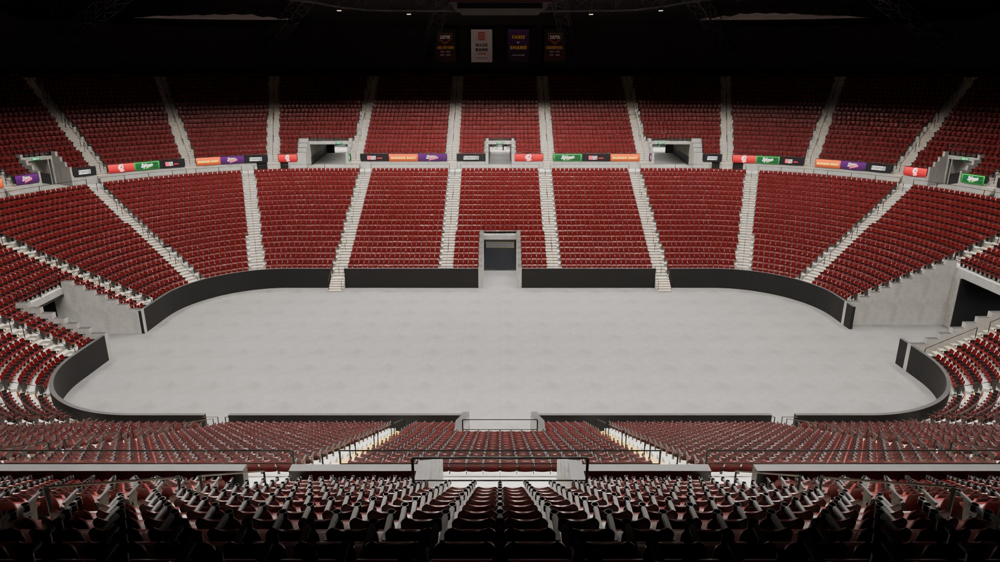
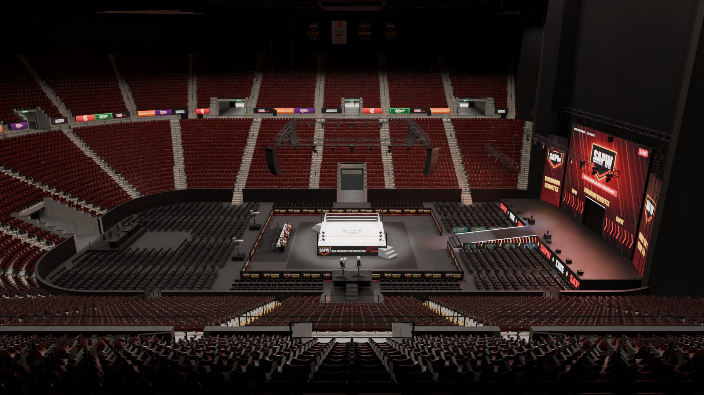
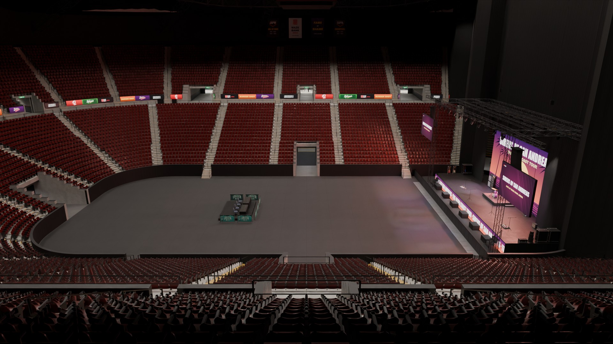
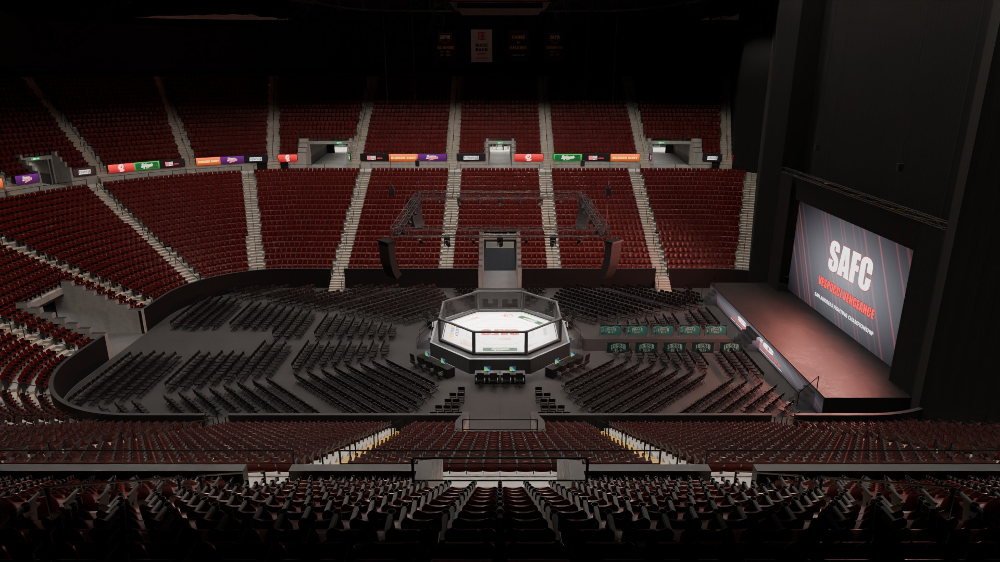
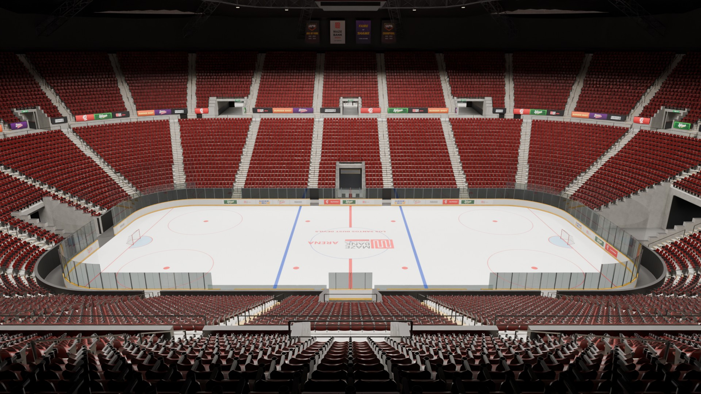
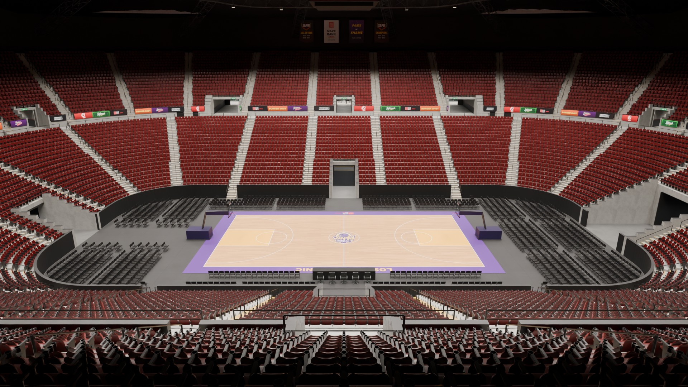
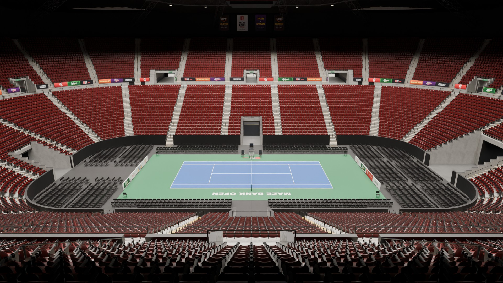

# mzb_arena: Maze Bank Arena full interior

A complete, walkable interior for the Maze Bank Arena (Del Perro / La Puerta), built inside the vanilla
exterior with no changes to the outside. The entire building is open:

- **Seating bowl.** Lower and upper tiers, about 18,650 seats, 11 vomitories, a cross aisle, stairs down to the floor,
  a four-sided centre-hung video board (16:9 screens, corner LED columns, a crown and a score ring, with its own content
  for every show), an LED ribbon, banners and EXIT signs. House lights are switchable (full / dimmed).
- **Street-level concourse.** Four glazed gateways with security (metal detectors, bag tables, ticket scanners,
  queue lines), a box office, guest services, concession stands, bars, a team store, men's and women's rest rooms
  (every toilet stall's door swings open as you walk in and closes behind you),
  vending, ATMs, a canopy with downlights, and murals.
- **Event level.** A service corridor runs round the back of the lower bowl at floor level, with a tunnel onto the
  event floor on every side: the event tunnel at the stage end, a team tunnel in the middle of each long side, and a
  5 m vehicle tunnel at the far end. Along the corridor are the home and visitors' locker rooms, a training room
  (power rack on a lifting platform, dumbbell rack, benches, bikes, treatment tables), a players' lounge, the officials'
  room, first aid, staff toilets, a vehicle garage off the far-end tunnel (a hot-water fill station, the snow melt
  pit), the ice plant (compressors, chiller, receiver, control panels) and three stores. Behind the stage are the
  backstage hall, two more locker rooms (showers, WCs, lockers), medical, officials, a press conference room,
  catering, admin, offices and the security control room.
- **Production control room.** Off the arena offices, behind a keypad door with an ON AIR light: a 10 x 3 video wall
  of multiviewers with the program and preview monitors in the middle (red / green tally) and studio clocks, a front row
  of consoles (vision mixer with its T-bar, graphics, two replay positions with jog-wheel controllers) and a back row on
  a riser (director and producer, the audio console with its meter bridge), acoustic wall panels, and an equipment
  annex with a row of 19" racks under a cable tray, the engineering bench and the UPS.
- **Loading dock.** Three working roller doors on the NW loading street, each an industrial shutter with its guide
  channels, coil hood, gear motor, hand chain, push-button station, beacon, bay sign and bollards: walk or drive up to
  one and press **E** to open or close it (inside or outside). Inside: heavy pallet racking loaded with stock, the day's
  delivery on pallets, a waste corner (baler with a finished bale, dumpster, cardboard cages, bins) by the doors, the
  dock office, the house staging decks, crowd barriers, cable trunks and power distro staged by the backstage opening,
  and LED high-bays under the plaza deck.
- **Switchable shows.** Each one is a set of interior entity sets, switched live for every player:

| Show | What you get |
|---|---|
| `wrestling` | Wrestling ring (turnbuckles, ropes, printed skirt, steel steps), entrance stage with titantron, ramp, pyro, a walk-through entrance curtain that moves when peds pass, the Gorilla position, commentary and timekeeper desks, ~1,200 floor chairs, a lighting rig and PA |
| `concert` | End stage with an LED wall, a full band backline (a detailed drum kit on a skirted riser, two guitar stacks, an 8x10 bass rig, a 2x12 combo, pedalboards, boom mics, a guitar vault and flight cases in the wings), a ground-support roof with moving heads, PA hangs, side screens, a general-admission floor with a photo pit barricade and a FOH mix riser |
| `hockey` | A 56 x 26 m ice rink (slippery: vehicles slide and players glide on it, see below): printed ice with the Maze Bank centre logo, dasher boards with a kick plate and GTA sponsor ads, glass on stanchions (taller at the ends), protective netting over the end glass, goals with nets, open player benches with doors onto the ice and glass behind them, the penalty and timekeeper boxes, the resurfacer's gate at the far end, and the board's hockey score |
| `basketball` | A printed hardwood court with its run-off, portable basket stanchions (padded base, glass backboard, rim and net, shot clock), team benches, the scorer's table with an LED front, about 1,150 floor seats (courtside rows on both sides, the ends seated to the walls) and the board's basketball score |
| `tennis` | A hard court with its run-off, the net and posts, the umpire's chair, players' chairs, line judges, sponsor boards behind the baselines, about 1,300 floor seats along both sides and at both ends, and the board's tennis score |
| `mma` | Fight night: a UFC-size octagon (9.1 m, the canvas 1.2 m up, a 1.8 m black chain-link fence, padded posts, two gates with steps and handrails, a printed canvas), the end stage with an LED wall and a walkway, a ring of cageside press and officials' tables with monitors, about 1,450 floor seats in rows out to the floor's edges, a lighting rig with moving heads and four line-array PA hangs over the cage, and the house dimmed |
| `house` | The empty arena with the house lights up |

The end-stage shows (wrestling, concert, MMA) mask off the seats behind the stage with black drapes and close the
vomitories behind them; the LED-wall stages (concert, MMA) are framed by legs and a border on a flown masking truss. The stage end's five lower sections are **telescopic**: for those shows they are stowed into
riser stacks, and the space becomes a real backstage area behind the masking, reached from the event tunnel. It has
wardrobe rails, a video village with monitors, catering, work lights and road cases. For the other shows the sections
are seated as usual.

All brands are GTA V's own, with the sponsor logos taken from the game's textures (Maze Bank, Sprunk, eCola,
Pisswasser, Cluckin' Bell, Fame or Shame, Burger Shot). The acts, teams and events are made up ("San Andreas Pro
Wrestling", "Sirens of San Andreas", the Los Santos Blizzard, SAFC, the Maze Bank Open, and so on).

## From the nosebleeds

Every show from the same seat, the back row of the upper tier.



| | |
|---|---|
| <br>**Wrestling** | <br>**Concert** |
| <br>**Fight night** | <br>**Hockey** |
| <br>**Basketball** | <br>**Tennis** |

## Requirements

- **Game build 2060 or newer** (`sv_enforceGameBuild 2060`). The interior uses vanilla props from the Diamond Casino
  Heist, After Hours and other DLC packs, and on older builds those props are missing.
- No framework or other resources.

## Install

1. Put the `mzb_arena` folder in your `resources` folder.
2. Add it to `server.cfg`:
   ```
   ensure mzb_arena
   ```
3. Allow your staff to run the arena command:
   ```
   add_ace group.admin command.arena allow
   ```

**Other map packs.** This resource streams its own `sp1_occl_01.ymap`: Rockstar's occlusion for the area, with the
occluders that would hide the interior through the glass removed. If another resource streams the same file (for
example `cfx-gabz-mapdata`), `ensure mzb_arena` **after** it. Otherwise the arena's interior can vanish when you look
at it from outside. Our file keeps everything else in it as Rockstar shipped it.

The resource also replaces a handful of vanilla `sp1_10` files (the painted fake interior, the glass panes in front of
the gateway doors, the loading street's roller-door panels and their collision). Any other resource that replaces
these exact files will conflict with it.

`bob74_ipl` is fine: the arena removes Rockstar's Fame or Shame lobby IPL, which stood where the concourse is now.

**Lighting.** The interior ships its own time-cycle modifiers (`data/mzb_timecycle.xml`: `mzb_arena_int`,
`mzb_arena_concourse`), so the bowl and the back-of-house rooms look the same at any hour or weather. The glazed
concourse keeps its daylight, without the outdoor fog.

## Commands (ACE `command.arena`)

The quick switch, for staff on the spot:

```
/mzb wrestling        switch the show for everyone (late joiners get it too)
/mzb basketball       ... wrestling concert mma hockey basketball tennis house
/mzb list             the shows, the current one in [brackets]
/mzb status           the current show and the dock doors
/mzb dock a open      the loading street's roller doors (a | b | c | all, open | close | toggle)
```

`/mzb` also takes the aliases in `Config.ShowAliases` (`/mzb fight` is MMA, `/mzb empty` is the empty house, and so
on), suggests the show names in chat as you type, and uses the same permission as `/arena`: one ACE line covers both.
The long form still works:

```
/arena show <name>
/arena dock <a|b|c|all> <open|close|toggle>
/arena status
```

Every switch is logged in the server console with the player's name. A short cooldown (`Config.SwitchCooldown`)
stops a switch being spammed, since each one reloads the interior for everyone inside.

`/arenainfo` (everyone, client side) prints the interior and room you are standing in, which helps when reporting
issues.

## Exports (server)

```lua
exports.mzb_arena:SetShow('concert')        -- true / false (unknown show; aliases work too)
exports.mzb_arena:GetShow()                 -- the current show's name
exports.mzb_arena:GetShows()                -- every show's name, sorted
exports.mzb_arena:SetDock('a', 'open')      -- 'a' | 'b' | 'c' | 'all', 'open' | 'close' | 'toggle'
exports.mzb_arena:SetLights({ on = true, mode = 'strobe', colors = { 'red', 'white' }, bpm = 150, house = 'off' })
exports.mzb_arena:LightPreset('goal')       -- a Config.LightPresets name (a goal horn script can call it)
exports.mzb_arena:GetLights()               -- the desk's current state
```

The current state is public in `GlobalState.mzbShow`, `GlobalState.mzbDock` and `GlobalState.mzbLights`, so a job
script or an ox_target panel can read it.

## Light desk (ACE `command.arena`)

The arena has its own light show on top of the interior's lighting: coloured spot lights from each show's rig (the
moving heads, beams and washes of the wrestling, concert and MMA rigs) and from the house lights up in the roof (every
show, and the only ones for hockey, basketball, tennis and the empty house). Every player in the bowl sees the same
show at the same moment.

`/arenalights` opens the desk: show lights on / off, the ring lights, blackout, the house lights (the show's
setting, full, dimmed, off), the effect, the movement, up to three colours from a palette or a colour picker, the speed
in BPM (with a tap button), intensity, the aim and presets. A look is built from independent parts, as on a lighting
console:

- **Effect** (the colour and level of each fixture): static, chase, strobe, pulse, rainbow, fade (a slow crossfade
  through the colours), wave (a band of light rolling round the rig), flash (the whole rig hits on the beat and dies
  away), alternate (every other fixture, swapping on the beat), bounce (a block of light running end to end), twinkle,
  random, lightning (dark, with ragged white flickers), fire (warm flicker) and police.
- **Movement** (where the beams go, with any effect): still, sweep, ballyhoo, fan (the spots open out and close in),
  nod (tilting out to the stands and back) and cross (pairs swinging across each other).
- **Aim**: floor, stage, crowd - or several at once (the fixtures take turns), e.g. floor and crowd.
- **Ring lights**: the washes on the truss over the ring (the cage, the concert stage) light it white on their own
  aim, with the show lights on or off - TV lighting for the match while the rest of the rig runs the show.
- **Presets**: walk-in, entrance, goal, concert, party, fight, police, TV ring, storm, inferno, hype, house up,
  blackout, reset.

It also runs from chat:

```
/arenalights on | off | blackout | status
/arenalights mode wave                (the effect)
/arenalights move fan                 (none | sweep | ballyhoo | fan | nod | cross)
/arenalights color red white          (names from Config.LightColors, or #rrggbb; up to three)
/arenalights focus floor crowd        (one to three of floor, stage, crowd)
/arenalights ring on | off
/arenalights bpm 128 | intensity 80 | house dim
/arenalights preset storm
```

The interior's own (baked) lights can't change colour in GTA; the house buttons switch them between full, dimmed and
off, and the desk's colour comes from the spot lights it draws. Players with photosensitivity: `Config.LightMaxStrobeHz`
caps the strobe (0 turns it into a pulse).

## Slippery ice

While the `hockey` show is up, the rink's surface is GTA's ice: vehicles slide on it, and on foot you keep your
momentum. You glide on when you let go, overshoot a stop and drift through turns, and a hard turn at a sprint can put
you on the ice. `Config.Ice` sets how slippery it is, the top gliding speed, and whether players can fall and how
often.

## Video on the screens (pmms and other TV scripts)

Every show's screens are one object on one render target, **`mzb_screens`**, so a single media player drives them
all: the titantron with its lower panels and wings (wrestling), the LED wall and the side screens (concert), the LED
wall (MMA), and the centre-hung board's four faces (every show). The picture and sound come from one source. With
nothing playing, the screens are clear and the show's own graphics show through.

The object sits at the centre of the arena floor. There is one model per show:

| Show | Model |
|---|---|
| `wrestling` | `mzb_screens_wrestling` |
| `concert` | `mzb_screens_concert` |
| `mma` | `mzb_screens_mma` |
| `hockey`, `basketball`, `tennis`, `house` | `mzb_screens_board` |

**pmms:** add these to `Config.models` in pmms' `config.lua`, then stand in the bowl, open pmms and pick the arena
screens:

```lua
[`mzb_screens_wrestling`] = { label = "Maze Bank Arena screens", renderTarget = "mzb_screens" },
[`mzb_screens_concert`]   = { label = "Maze Bank Arena screens", renderTarget = "mzb_screens" },
[`mzb_screens_mma`]       = { label = "Maze Bank Arena screens", renderTarget = "mzb_screens" },
[`mzb_screens_board`]     = { label = "Maze Bank Arena screens", renderTarget = "mzb_screens" },
```

Any other TV or cinema script that plays on a model through a named render target works the same way: register the
model(s) above with the render target `mzb_screens`. Switching the show swaps the screen object, so start the video
again after a switch.

## Built-in screen player (ACE `command.arena`)

The arena can play on its own screens without another resource: a YouTube video, a cycle of pictures or one
picture, on every screen of the show at once, the same moment for every player (late joiners too). Run it from the
light desk's **Screens** section (paste a link, play / pause / off, volume, picture sets) or from chat:

| Command | What it does |
|---|---|
| `/arenascreen <youtube link or id>` | play a video (watch, youtu.be, shorts, embed and live links all work) |
| `/arenascreen <picture url> [more ...]` | one picture, or a cycle of several (https only) |
| `/arenascreen images [set]` | a picture set from `Config.Media.imageSets` |
| `/arenascreen pause` / `resume` / `off` | |
| `/arenascreen volume <0-100>` / `interval <s>` | the video's volume; seconds per picture |
| `/arenascreen status` | what is on |

The video's sound comes from the screens' browser, which is not positional: it is full in the bowl, low in the rooms
that open onto it (concourse, tunnel, backstage, stairs: `Config.Listener`) and silent outside the building.
Your own pictures go in `html/img/` and into a set in `Config.Media.imageSets` as `img/<file>`; restart the resource.

**Living with pmms and TV scripts:** the built-in player only touches the `mzb_screens` render target while it is
playing something. Turn it off (`/arenascreen off`) before starting pmms on the screens, or set
`Config.Media.enabled = false` to leave the screens to the other script for good.

**YouTube:** some videos refuse to play embedded (the owner turned embedding off, or age / region limits); the
screens then stay dark. YouTube also expects a web page origin for embeds; if every video fails on your server
build, that is the cause and a picture cycle still works.

Exports (server): `SetScreenMedia(urlOrListOfPictureUrls)`, `ScreenImageSet(name)`, `ScreenOff()`,
`ScreenPause(on)`, `ScreenVolume(0-100)`, `GetScreenMedia()`. Client: `IsScreenMediaOn()`.

## Music player (ACE `command.arena`)

Music off the light desk, heard from the show's PA speakers, with no sound resource needed (no xsound). Paste a link
in the desk's **Music** section or use chat; every player hears the same moment of the track (late joiners too):

| Command | What it does |
|---|---|
| `/arenamusic <url>` | play a direct audio file or stream (mp3, ogg, m4a, an icecast / shoutcast stream) or a YouTube link |
| `/arenamusic pause` / `resume` / `stop` | |
| `/arenamusic volume <0-100>` | the level for everyone |
| `/arenamusic status` | what is playing (anyone may ask) |
| `/arenamusic mine <0-100>` | **your own** level, for you only, kept between sessions (anyone; also the desk's "Mine" slider) |

How it sounds: the level falls with the distance to the nearest PA hang of the show (`Config.Music.hangs`: the ring
truss's corners for wrestling and MMA, either side of the stage for the concert, the centre-hung board otherwise), it
pans towards the hangs as you turn, and the room shapes it: full with the arena's echo in the bowl, muffled and quieter
in the rooms that open onto it (concourse, tunnel, backstage, stairs), faint elsewhere in the building, nothing
outside. Far from the arena (`Config.Music.range`) the track is not even loaded.

**What gets the full treatment:** the filter, the pan and the echo need the browser to read the audio, which the
audio's server must allow (CORS: `Access-Control-Allow-Origin`). Files and streams from servers that do not send it
still play, but with the level only (no pan, filter or echo); so does YouTube (the player is a hidden YouTube
embed, whose sound a page cannot touch). Plain `http://` links may be blocked by the game's browser: use `https://`.
A link that will not play is reported once to whoever started it, not to everyone.

Exports (server): `PlayMusic(url)`, `StopMusic()`, `PauseMusic(on)`, `MusicVolume(0-100)`, `GetMusic()`.

## Followspot (ACE `command.arena`)

One or two followspots high on the bowl's long sides (`Config.FollowSpot.fixtures`), run by an operator from the
desk's **Followspot** section or chat:

| Command | What it does |
|---|---|
| `/arenaspot on` / `off` | |
| `/arenaspot follow <id \| me \| look>` | lock onto a player: a server id, yourself, or whoever is under your crosshair |
| `/arenaspot free` or the key **F7** | grab free aim: the spot follows your camera; again to let go (it stays put) |
| `/arenaspot color <name \| #rrggbb>` / `size <2-15>` / `intensity <0-100>` | |
| `/arenaspot status` | |

Locked onto a player, every client follows that player itself, so it is smooth and sends nothing over the network.
Free aim sends the operator's aim point at most 8 times a second (`Config.FollowSpot.sendRate`); the server keeps it
inside the arena and only one operator aims at a time. Players can rebind the key under Settings > Key Bindings >
FiveM ("Arena followspot").

Exports (server): `SetFollowSpot(patch)`, `FollowPlayer(serverId)`, `GetFollowSpot()`.

## Configuration (`shared/config.lua`)

- `Config.DefaultShow`: the show the server starts with.
- `Config.Shows`: which entity sets each show turns on. You can remove a show, or make your own mix from the sets
  listed there.
- `Config.ShutterSeconds`: how long the roller doors take to open or close.
- `Config.DockButtons`: the **E** prompt at each roller door (`false` = staff commands only).
- `Config.DockAccess`: who may use it: `false` for everyone, or an ACE such as `'command.arena'` for staff only.
- `Config.DockReach` / `Config.DockReachVehicle`: how close you must be, on foot and at the wheel (metres).
- `Config.Command`: the name of the admin command.
- `Config.QuickCommand`: the quick switch's name (`mzb`), or `false` to turn it off.
- `Config.ShowAliases`: other words the quick switch accepts for a show.
- `Config.SwitchCooldown`: seconds between two switches.
- `Config.AnnounceSwitch`: `true` tells every player in chat when the show changes.
- `Config.LightCommand` / `Config.LightAccess`: the light desk's command and who may use it (an ACE, or `false` for
  everyone).
- `Config.LightPresets` / `Config.LightColors`: the desk's presets and named colours: add your own.
- `Config.LightBrightness`, `Config.LightCone`, `Config.LightSpread`, `Config.LightMaxFixtures`,
  `Config.LightLensGlow`: how the show lights look and how many are drawn.
- `Config.LightMaxStrobeHz`: the fastest strobe (0 = no strobing).
- `Config.RingLightGroup`, `Config.RingLightColor`, `Config.RingLightBrightness`: which of the rig's fixtures are the
  ring lights (2 = the washes), their colour and brightness.
- `Config.LightRooms`: the rooms the light show is drawn in.
- `Config.HouseSets`: the interior's house light sets the desk switches.
- `Config.Ice`: the hockey ice (on / off, the shows it is down for, how slippery, falls).

## Notes

- There is no ped navmesh inside the building yet. Players can go everywhere, but ambient NPCs will not walk it.
- Framework independent: plain FiveM natives only, with no ESX / QBCore / Qbox requirement.

## Changes

- **1.1.0**: the light desk grows up.
  - Eight new effects (fade, wave, flash, alternate, bounce, twinkle, lightning, fire) and the
    movement is its own control (still, sweep, ballyhoo, fan, nod, cross), so any effect runs with any movement.
    Sweep and ballyhoo as modes still work (from chat, exports and old presets).
  - Aims combine: floor, stage and crowd in any mix, the fixtures taking turns.
  - **Ring lights**: the washes over the ring light it white whether the show lights are on or not.
  - New presets: TV ring, storm, inferno, hype. Blackout also kills the ring lights.
- **1.1.0** (continued): the event level, backstage and the gateways reworked.
  - **The Gorilla position** is rebuilt as a proper room between the event tunnel and the stage: the producers' desks
    (two seats each) along the back wall, the timekeeper's and match producer's desk at the top, the ARENA exit straight
    onto the stage stairs, and a BACKSTAGE opening on each side into the backstage areas behind the masking (they were
    walled off). Same look as before (dark wood, LED dado, the show's screens), now with a solid panel ceiling. All four
    openings (the walk-out, the entrance from the tunnel and the two BACKSTAGE ones) have the walk-through curtain,
    each wider than its opening and hung just under its head, instead of doors.
  - **Walls popping in and out**: faces that ran across two rooms (the media room's tiled wall, the locker rooms'
    walls, the reveals of every door, tunnel and vomitory, and many more) are cut at the dividing walls and doorways,
    and each piece belongs to the room it faces. The floor collision now changes room exactly at each doorway and inside
    the vomitories: standing just past a door could make the game hide the room you were standing in.
  - **The event-level ring corridor** is 3.4 m wide all the way round: the west arcs (2.0 m) are widened outwards, the
    backstage's east wall moved back to make room (on the south arc, by the locker rooms, it narrows to 2.6 m for a
    few metres). Four side hallways off the west arcs end in fixed double doors (ELECTRICAL, SECURITY, COMMS ROOM,
    PLANT ROOM); the new signs are in `mzb_tx_event`.
  - **Box office windows**: the 20 ticket windows in the facade's diagonal sections looked straight into the concourse
    through the arena's own glass and its mullions. They now have closed roller shutters (placed outside the interior,
    in `mzb_arena_milo.ymap`, so they always draw from the street).
  - The Gorilla's openings are signed (ARENA to the stage, BACKSTAGE either side).
  - **Stair landings**: the top landings of the NW and SE stairs (concourse level) were open over the flight below for
    about 1.5 m (a 4.5 m drop). A concrete parapet, 1 m high with collision, now continues the dividing wall.
  - **Bowl exits**: the floors of the passages from the bowl into the ring corridor were black matting; they are the
    corridor's concrete now.
  - **Flickering walls (z-fighting)**: wherever two surfaces lay in exactly the same plane they flickered in a sawtooth
    against each other - the black fascia band round the front of the upper tier over the concrete, the stowed seating's
    fascia, stair and seat nosings over the treads, the PA speakers' grilles, the Gorilla's LED dado, finishes in the
    toilets, locker rooms and backstage, the locker-room mirror over its tiles, the flight cases' trims and corners. The
    surface that belongs on top now sits 3-6 mm proud of the one under it (the mirror's reflection plane moved with
    it). The side hallways' door details and signs are spaced off the door and back plate the same way.
  - A 13 cm slot along one riser row of the lower seats (over the rooms under them, both sides and the east end) is
    closed: the rooms' ceilings showed through it, and from the bowl it was a black line.
  - The security control room's north wall and parts of the SE stair's shaft belonged to the neighbouring rooms.
  - The roof deck and trusses over the middle of the bowl belonged to the concourse: looking up from the floor showed
    holes to the sky. A strip of the corridor floor along the east store and the garage belonged to those rooms (a
    gap along the wall).
  - The backstage door into the NW stair is rebuilt square to the stair's angled wall (the wall ran through its frame).
  - The cream panel sticking out of the wall by the locker-room door in the backstage hall is gone, with the 1 cm
    ceiling and floor stripes along that wall.
  - Toilet stall doors no longer swing into the partitions and walls (each door has its own stops).
  - **Gateway doors**: the north, west and south entrances could not be walked through - the building's collision still
    had the facade glass across them (only the east one was open). All four are open now.
  - Mirrors: the concourse rest rooms' mirrors are reflective glass (only one live mirror per room works in GTA); the
    single-mirror rooms keep live mirrors, fixed.
  - Outside sounds: the street, the wind and the rain are no longer heard inside (`audio/mzb_arena_game.dat151.rel`
    and portal audio occlusion).
  - The interior's exit-portal count includes its mirrors, as in 1.0.2: 48 for the rebuilt interior (44 openings and
    4 mirrors).
- **1.0.2**: the interior's exit-portal count now includes its mirrors, the way Rockstar's own interiors count them
  (62 instead of 44). Preventive: no arena fault was reported, but the same miscount was involved in a client crash
  in another interior. Only `stream/interior/mzb_arena_milo.ymap` changed.
- **1.0.1**: fixed players sinking through the floor on the four corners of the bowl (the walkway between the lower and
  upper seats and the mouths of the upper-deck entrances). The collision on the curved parts was built inside out.
  Basketball is now the Los Santos Panic (purple and gold court with the team's crest) vs the Vice City Narcos, hockey
  the Los Santos Dust Devils vs the Los Santos Kings. The Arena War banners on the outside of the building
  (`xs_arena_banners_ipl`) are removed while the resource runs.

## License

Free to use on your own servers, but **not open source**. You may not sell, re-upload or redistribute this resource,
or reuse any part of it (models, textures, collision, maps, scripts) in another resource, free or paid. See
[LICENSE](LICENSE).
